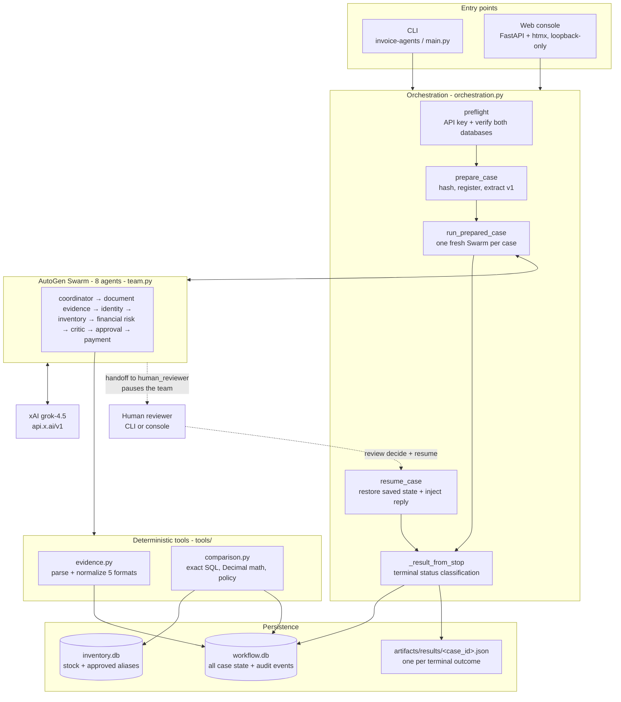
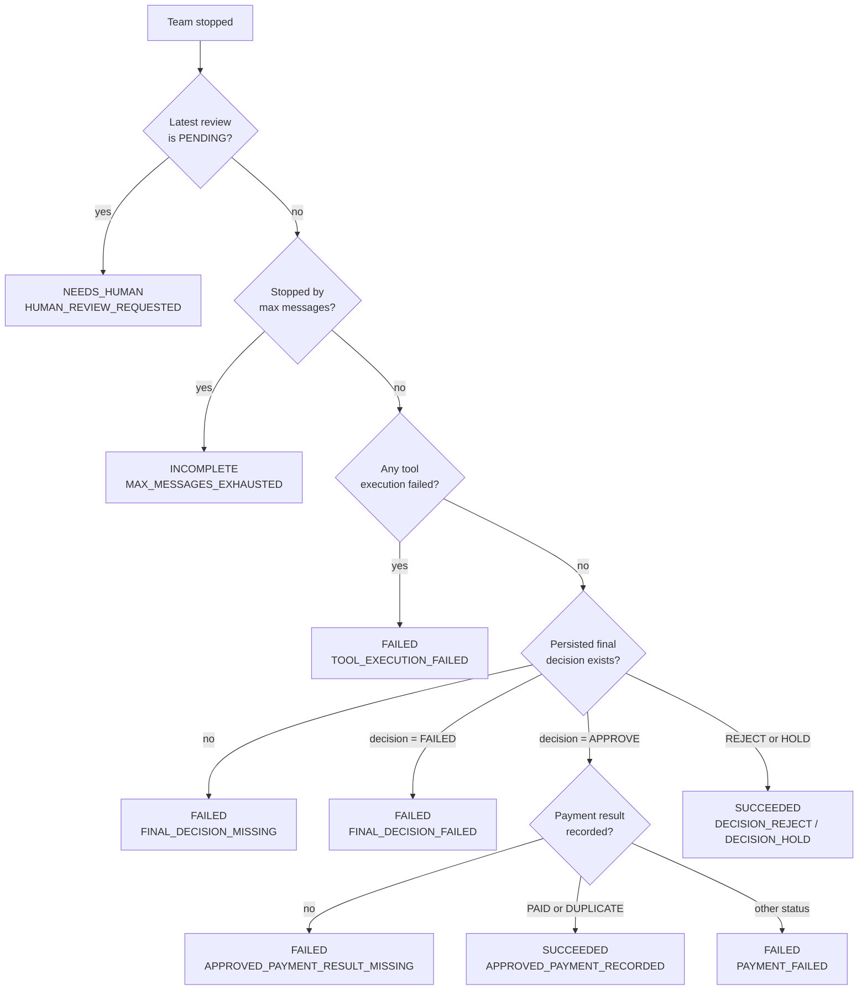
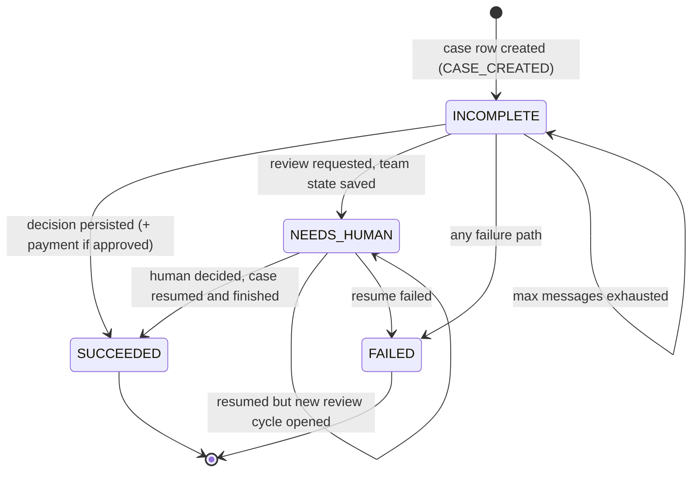
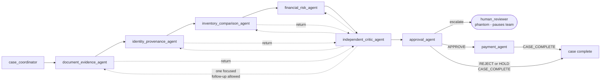
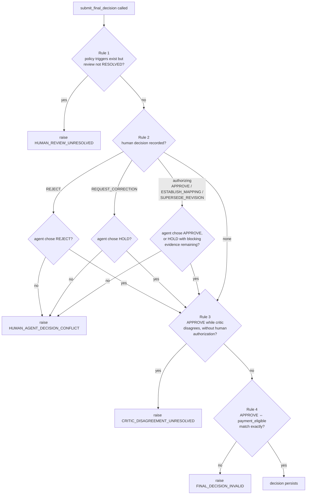
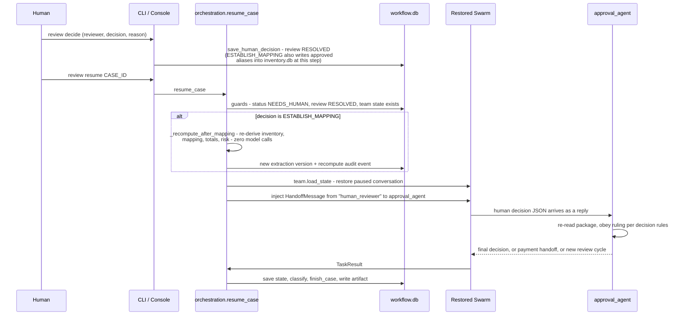
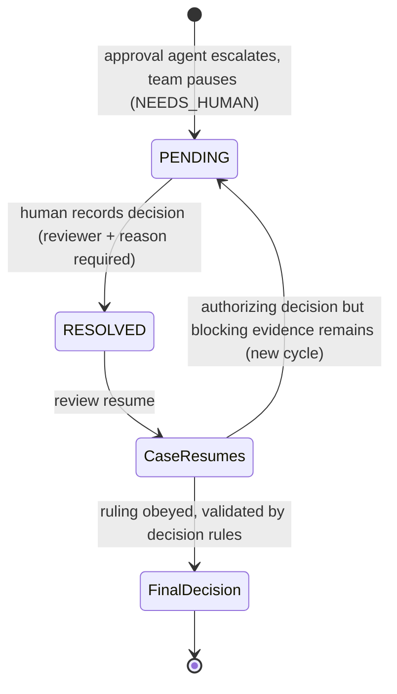
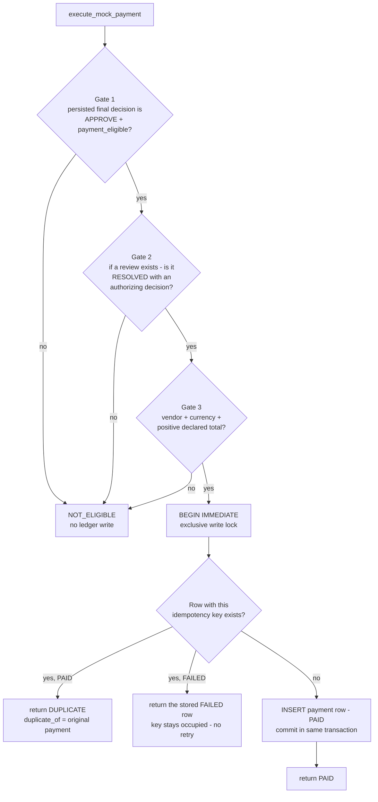
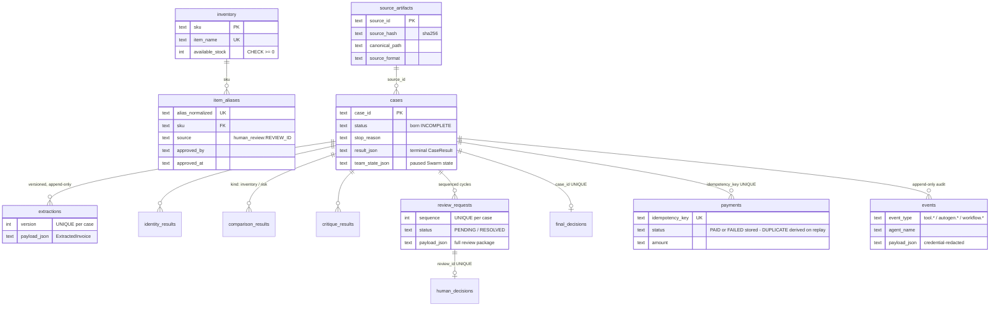
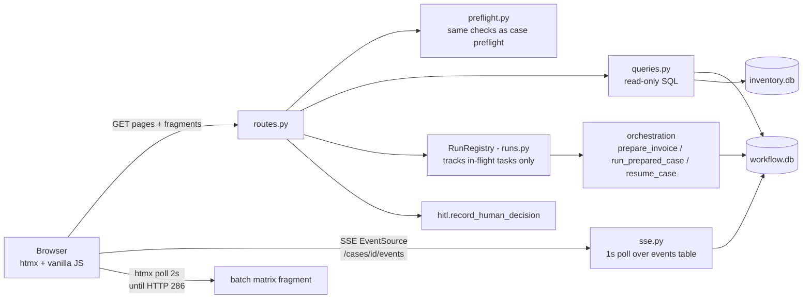

# System guide

A semi-technical walkthrough of the Galatiq invoice-processing system: what it is, how a case
moves through it, what each of the eight AI agents does and how, and how the surrounding
machinery (tools, decision rules, human review, payments, storage, and the web console)
guarantees that every outcome is explicit and auditable.

This guide complements [`REFERENCE.md`](REFERENCE.md) (operational reference) and
[`DEMO.md`](../DEMO.md) (business walkthrough). Everything below was derived from the code;
module names are given so you can go one level deeper when you need to.

---

## 1. What this system is

The system reads an invoice file (txt, json, csv, xml, or pdf), checks it against a local
inventory database, recomputes all the money exactly, and ends in one of four business
outcomes: the invoice is **approved and paid** (mock payment), **rejected**, **held**, or the
system **stops and asks a human**. Failures and interrupted runs are additionally recorded as
explicit `FAILED` / `INCOMPLETE` case statuses — there is no silent outcome. A team of eight
AI agents — an AutoGen `Swarm` powered by xAI `grok-4.5` — drives the reasoning, but three
design rules keep the AI honest:

1. **The model never computes facts.** Every number, database row, and date classification is
   produced by deterministic Python tools. Agents look at evidence and route the case; they
   cannot invent a total, a stock level, or a payment.
2. **Every decision is gated by pure rules.** A final decision only persists if
   `decision_rules.validate_final_decision` accepts it. Prompts instruct the agents, but the
   rules raise exceptions regardless of what the model says. Nothing defaults to approval.
3. **No outcome without a persisted record.** When a run stops, the decision-bearing
   branches are classified from what was *persisted* — the latest review row and the final
   decision are re-loaded from the database — while the run's own observations (the stop
   reason, tool failures, the payment result) fill in the remaining branches. A stopped team
   with no persisted decision is `FAILED`, never silently approved.

---

## 2. Anatomy of a case

A **case** is one processing attempt for one submitted file. Its life has three phases:
preparation (deterministic, free), the agent run (model calls, paid), and classification
(deterministic).

### 2.1 Preparation — before any model call

`prepare_invoice` in `orchestration.py` runs first and costs nothing:

1. **Preflight** — the xAI key must be configured and *both* SQLite databases must pass strict
   verification (correct signature, integrity, exact schema version, required tables, indexes,
   and seed rows). Preflight only verifies; it never repairs. A failure here still produces a
   terminal `FAILED` result JSON, so every outcome has an artifact.
2. **Source registration** — the file is hashed (SHA-256) and given a deterministic
   `source_id`; the case row is created in `workflow.db`, *born* `INCOMPLETE` with stop reason
   `CASE_CREATED`. A crash mid-run can therefore never leave a case looking successful.
3. **Extraction v1** — the file is parsed into a structured `ExtractedInvoice` and persisted
   as immutable version 1. In a batch, preparation runs sequentially for all files *before*
   any agent runs, so every case's identity agent can see all sibling submissions (that is how
   duplicate txt/pdf pairs find each other).

### 2.2 The agent run

`run_prepared_case` builds a **fresh model client and a fresh eight-agent Swarm for every
case** — agents and conversation history are never shared between cases. The team streams
until one of three termination conditions fires:

| Termination | Meaning |
|---|---|
| Handoff to `human_reviewer` | The approval agent escalated; the team pauses and the case becomes `NEEDS_HUMAN`. |
| The text `[CASE_COMPLETE]` | The approval or payment agent finished the case cleanly. |
| Max messages reached (default 40) | Circuit breaker; the case becomes `INCOMPLETE`, never a silent success. |

Every streamed AutoGen event — model messages, tool calls, tool results, handoffs — is
persisted to the `events` audit table as it happens. After the stream stops, the Swarm's full
conversation state is saved to the case row so a paused team can be resumed later.

### 2.3 Classification — every stop becomes exactly one status

`_result_from_stop` maps the stop into exactly one status. The review row and the final
decision are re-loaded from the database; the stop reason, tool failures, and payment result
come from the run itself. The precedence order matters:

Two things are worth noticing. A rejection is a **successful** workflow outcome — the system
did its job by refusing a bad invoice. And a `DUPLICATE` payment also counts as success,
because the ledger is idempotent: re-processing an already-paid invoice correctly refuses to
pay twice.

Any exception anywhere — provider outage, database error, schema violation — is caught,
categorized into an `ErrorRecord`, and produces a terminal `FAILED` result. The result JSON at
`artifacts/results/<case_id>.json` is written for **every** terminal outcome, including
failures that happen before a model call.

### 2.4 Case status lifecycle

---

## 3. The agent team

The team is a fixed relay with one built-in skeptic. Each agent is *least-privilege*: it holds
only the tools for its own stage, and each tool is an async closure over that case's private
context (`AgentCaseContext`). All eight share one pinned model client — `grok-4.5` at
`api.x.ai/v1`, `reasoning_effort="high"`, parallel tool calls disabled.

### 3.1 What each agent does

**`case_coordinator`** — opens the case. It calls `get_case_metadata` exactly once, which
returns the case identity and the required seven-stage work plan (document evidence, identity,
inventory, financial risk, independent critique, approval, payment-if-eligible). Its prompt
forbids it from deciding invoice facts or claiming completion; it simply hands off to the
document agent.

**`document_evidence_agent`** — establishes what the invoice *says*. Its tool
`extract_and_record_invoice` re-parses the source file with the same deterministic parser used
at preparation (same hash, never a canned value) and persists the extraction as a new version.
The re-parse is deliberate: preparation's v1 extraction exists so batch identity checks can
see every submission before any swarm runs, while the agent's own parse makes its
`tool.invoice_extracted` audit event a live derivation from the source rather than a replay of
a stored record. Because the parser is deterministic and extraction versions are append-only,
the redundancy costs nothing beyond a file read.
Each header field — invoice number, vendor, dates, terms, currency — is an `EvidenceValue`
carrying the raw text, the normalized value, a description of the normalization, a confidence
score, any ambiguity note, and `EvidenceRef`s pointing at the exact
line/row/json-path/xpath/page/file it came from; each line item carries its own raw values and
refs, and declared totals are recorded as exact decimals. The agent inspects missing fields
and ambiguities but is told to "do not repair or approve anything."

**`identity_provenance_agent`** — asks "have we seen this invoice before?" Its tool queries
all prior cases sharing the invoice number *or* vendor and classifies each as
`EXACT_ARTIFACT` (same file hash), `DUPLICATE_REPRESENTATION` (same invoice number and vendor
in a different file — typically another format — with matching declared totals),
`POSSIBLE_REVISION` (same invoice, different revision label), or `CONFLICT` (partial or
contradictory identity). It never picks a winning revision — that is a human's call.

**`inventory_comparison_agent`** — maps invoice line items onto the inventory database. The
tool resolves each distinct item name by **exact name match**, then by **human-approved
alias**; anything else stays unresolved with fuzzy *suggestions* that can never auto-accept.
Quantities are aggregated per SKU before checking stock, so an invoice that splits one order
across many lines cannot sneak past the stock limit. Mapping outcomes are written back as a
new extraction version (v1 stays immutable). Results carry statuses like `AVAILABLE`,
`EXCEEDS_STOCK`, `OUT_OF_STOCK`, `UNKNOWN`, `AMBIGUOUS`.

**`financial_risk_agent`** — recomputes the money and applies policy. Its tool re-derives
every line extension, subtotal, tax, and grand total in exact `Decimal` arithmetic, compares
them with the declared amounts (any nonzero delta is recorded), classifies every date
(`EXACT` / `AMBIGUOUS` / `RELATIVE` / `INVALID` / `MISSING`), and evaluates the configured
review policy — producing the `policy_review_reasons` list that later forces human review. It
also restates five reconciliations this prototype *cannot* do (no vendor master, PO, price
catalog, tax table, or bank data), so no agent can imply a check that never happened.

**`independent_critic_agent`** — the built-in skeptic. It receives the immutable evidence
package and must challenge it before any approval. Crucially it has real computation, not just
opinions: `recheck_inventory_item` re-derives a stock row and alias provenance straight from
the database, and `recompute_line` redoes one line's arithmetic. Its prompt requires it to
verify at least one disputed mapping or amount "instead of narrating." It records exactly one
structured `Critique` with a recommended disposition (`APPROVE`/`REJECT`/`HOLD`/`FAILED`), and
may send exactly one focused follow-up back to a specialist. It is explicitly told the known
scope limits are not, by themselves, reasons to hold — and that it may never approve or pay.

**`approval_agent`** — the only agent that can *decide* a case: it alone can persist the
final decision or escalate to a human. It fetches the approval package
(invoice identity, risk, critique, any human review, and the deterministically derived
`unaddressed_blocking_evidence` list) and then follows a strict script:

- If policy triggers exist and no review does — or if it would approve against a disagreeing
  critic — it persists a review package and hands off to `human_reviewer`, pausing the team.
- A resolved human `REJECT` forces a final `REJECT`; a resolved `REQUEST_CORRECTION` forces
  `HOLD`. Those rulings are final.
- An *authorizing* human decision (`APPROVE`, `ESTABLISH_MAPPING`, `SUPERSEDE_REVISION`)
  permits approval. If blocking evidence remains, the agent's script is to open a *new*
  review cycle recommending `HOLD` instead of approving over it (the rules permit `HOLD` in
  exactly that situation) — a human "yes" is treated as covering only what it addressed.
- With no triggers and no disagreement, it decides independently.

An `APPROVE` must be marked payment-eligible and handed to the payment agent; `REJECT` and
`HOLD` end with `[CASE_COMPLETE]`. "Never invent a default decision."

**`payment_agent`** — the narrowest agent of all. It calls `execute_mock_payment` exactly
once, reports the exact status ("never translate failure or NOT_ELIGIBLE into success"), and
ends the case.

### 3.2 The phantom ninth seat

`human_reviewer` is a handoff target and a termination trigger, but **no such agent exists in
the Swarm**. Handing off to it simply stops the team. When a human later decides and the case
resumes, orchestration restores the saved team state and injects a forged
`HandoffMessage(source="human_reviewer", target="approval_agent")` carrying the decision JSON
— from the approval agent's perspective, a colleague finally replied. The team continues
mid-conversation; nothing re-runs.

### 3.3 Why the model cannot cheat

Prompts are guidance; the enforcement is structural:

- **Stage order is enforced by persistence, not prompts.** Risk analysis raises if the
  inventory comparison is not stored; critique and approval raise if risk is not stored.
- **Tool inputs are trivial.** The only free-form numeric input any agent supplies is
  `recompute_line(quantity, unit_price)` — which raises on anything that is not an exact
  decimal string.
- **All decisions pass through pure rules** (next section) that raise on violation.
- **Every tool call is audited** with the agent's name and the database row it produced, and
  every model event is persisted verbatim.

---

## 4. The decision safety net

`agents/decision_rules.py` is a small, pure module — no I/O, no model — whose motto is its
first line: *"every violation raises and nothing defaults to approval."*

**Blocking evidence** is the deterministic list a human authorization can never implicitly
clear: any inventory line in `EXCEEDS_STOCK`, `OUT_OF_STOCK`, `UNKNOWN`, or
`INVALID_QUANTITY`, plus any nonzero declared-vs-calculated total delta.

`validate_final_decision` applies four ordered rules before any final decision may persist:

A companion rule, `assert_new_review_cycle_permitted`, protects the review queue: after a
human `REJECT` or `REQUEST_CORRECTION`, the only lawful continuation is the forced final
decision — attempting to open another review raises `HUMAN_DECISION_MUST_BE_OBEYED` instead of
looping the queue. After an *authorizing* decision the rule permits a further cycle
unconditionally; opening one only when blocking evidence remains is the approval agent's
scripted behavior, backstopped by review creation refusing a package with zero
evidence-backed reasons.

Rule 4 enforces the full `APPROVE ⇔ payment_eligible` biconditional; a Pydantic validator on
the `FinalDecision` model independently re-enforces the payment-eligible-requires-APPROVE
direction.

---

## 5. Human-in-the-loop review

### 5.1 What sends a case to a human

The review policy is **configuration and code, not prompts**. `build_risk_assessment` produces
a `policy_review_reasons` entry for each of:

- Currency different from the configured threshold currency (no approved FX policy), or
  declared amount at/above the review threshold (default 10,000.00 USD, effective 2026-08-06)
- Any missing required field, extraction conflict, or currency ambiguity
- Extraction notes matching ambiguity/OCR/relative-date/urgent/wire-transfer patterns
- Any inventory line not `AVAILABLE` (exceeds stock, out of stock, unknown item, ambiguous
  mapping, invalid quantity, or query error)
- Financial evidence not exact (any delta, or tax that cannot be recomputed)
- Any identity candidate (prior duplicate, revision, or conflict)
- Any date not exact; due date on/before invoice date; due date deviating from stated Net-N
  terms beyond the tolerance (default 3 days)
- Suspicious signals (urgent/wire/penalty language, zero-or-negative quantities)

One more trigger is added at review time rather than by policy: if the approval agent wants to
approve but the critic disagreed, the disagreement itself becomes a review reason.

### 5.2 The review package and the decision

When the approval agent escalates, `create_review_request` persists a complete, self-contained
package: deduplicated reasons, the amount, the full evidence bundle (invoice, financial,
inventory, identity, dates, suspicious signals, the disclosed unavailable reconciliations),
the agent's recommendation and rationale, the critic's full critique, four fixed reviewer
questions — and, for PDFs, rendered page images (page 1 always; documents up to 3 pages in
full). A render failure aborts review creation: a review never promises evidence it lacks.

The human decides via CLI (`invoice-agents review decide`) or the console. Five decisions
exist, each with a fixed consequence:

| Human decision | Kind | Effect on the case |
|---|---|---|
| `APPROVE` | authorizing | Permits approval; if blocking evidence remains, the agent is scripted to open another review cycle recommending `HOLD` instead of approving over it |
| `ESTABLISH_MAPPING` | authorizing | Writes human-approved item aliases (with provenance) into `inventory.db` at decide time; a deterministic recompute re-derives all evidence before the team resumes |
| `SUPERSEDE_REVISION` | authorizing | Records which prior case this one supersedes (same authorizing effect as `APPROVE`); the prior case's stored row is not modified |
| `REJECT` | final | Forces the final decision `REJECT` |
| `REQUEST_CORRECTION` | final | Forces the final decision `HOLD` |

Reviewer and reason are mandatory. Recording is transactional and replay-safe: submitting the
byte-identical decision twice is a no-op; a *different* decision raises
`REVIEW_ALREADY_RESOLVED`.

### 5.3 Resume

The review lifecycle over the whole case:

Review cycles are sequenced (`UNIQUE(case_id, sequence)`) — schema v2 explicitly migrated away
from one-review-per-case so an authorizing decision that does not cover all blockers can spawn
cycle 2, while final rulings can never be re-litigated.

---

## 6. Payment

The payment is a mock — no real funds move — but it is engineered like a real one, as a
ledger with idempotency.

**The idempotency key is `sha256(vendor | invoice_number)`, casefolded and normalized — and
deliberately excludes the file format, file hash, amount, and revision.** A revised invoice
with a different total from the same vendor and number is a `DUPLICATE` of the original
payment, not a new payable; paying revisions would require a separately reviewed adjustment
design. Duplicate protection is two-layer: the exclusive transaction serializes concurrent
attempts, and a `UNIQUE` constraint on the key makes any race a hard error rather than a
second payment.

Two states are impossible by construction:

- **Paid-but-unrecorded** — `PAID` only exists as a committed ledger row. A crash before
  commit leaves no row (nothing was paid, so a rerun simply pays); a rerun after a committed
  payment resolves to `DUPLICATE` off the ledger.
- **Approved-but-unpaid (silently)** — the status classifier fails any approved case without
  a payment result (`APPROVED_PAYMENT_RESULT_MISSING`) or with a bad one (`PAYMENT_FAILED`).
  The gap is a loud `FAILED` case, never a quiet success.

Defense in depth: gate 2 re-verifies the human review even though the decision rules already
blocked an unauthorized approval — the ledger does not trust that the LLM persisted only what
it was allowed to.

---

## 7. Persistence and audit

Two separately versioned SQLite databases, one JSON artifact directory, and an append-only
event log.

### 7.1 The two databases

**`inventory.db` (schema v1)** — the authoritative reference data. Read-only during
processing (connections are opened with SQLite's `mode=ro`), written only by the human-review
mapping flow.

**`workflow.db` (schema v2)** — everything mutable: cases, versioned extractions, evidence,
reviews, decisions, payments, and the audit log. `WorkflowStore` is the typed gateway for
case, extraction, evidence, review, and decision mutations; the payment ledger writes through
its own exclusive transaction, and audit events are appended directly by `AuditRecorder`.

### 7.2 Schema lifecycle

Migrations are versioned SQL files applied only by explicit commands (`invoice-agents db
migrate/seed/verify`) or by the `ui` command's idempotent `ensure_databases` bring-up. Normal
case processing **never** migrates or repairs. Preflight verification demands the schema
version match *exactly* — a database that is too new is rejected as hard as one that is too
old — and pins the four inventory seed rows verbatim (WidgetA 15, WidgetB 10, GadgetX 5, and
the deliberate zero-stock trap row FakeItem 0).

### 7.3 The audit trail

`AuditRecorder` appends every step to the `events` table: case preparation, provider
configuration, every AutoGen stream event (`autogen.*`), every tool result (`tool.*`), review
and decision milestones (`workflow.*`), the post-mapping recompute, provider retries, and the
terminal result. Payloads pass recursive credential redaction before persisting, and every
event doubles as an OpenTelemetry span carrying the case ID and agent name. Even the retry
count in the usage summary is recomputed from persisted `provider.retry` events rather than
trusted to an in-memory counter.

The result artifact `artifacts/results/<case_id>.json` is the complete terminal record —
status, stop reason, final decision, review package, payment, all errors, and token/latency
usage. For reviews of PDFs, rendered page images live under `artifacts/reviews/<review_id>/`.

---

## 8. The web console

The "Galatiq Invoice Console" (`invoice-agents ui`, default `127.0.0.1:8787`) is a local
FastAPI + Jinja2 + htmx app with no authentication — which is why it refuses to bind a
non-loopback host without an explicit flag. Its cardinal rule: **storage is the single source
of truth.** The console renders stored state verbatim — it never recomputes, softens, or
reinterprets a status — and mutates only through the same three service seams the CLI uses:
prepare/run, resume, and record-human-decision.

The pages:

| Page | What it shows |
|---|---|
| **Dashboard** `/` | Preflight strip (databases + key health; run actions disabled until green), status-count tiles, filterable case table. A broken database still blocks all work, but instead of a 500 taking down the console, the dashboard stays up to report the failure: the strip shows the exact stop reason, the verbatim error, and the copy-pasteable fix command. |
| **Submit** `/submit` | Pick sample invoices or upload (uploads are copied into the corpus so hash provenance stays meaningful). One file → live case view; several → batch. |
| **Live case** `/cases/{id}/live` | Real-time event timeline via SSE; the terminal banner comes from the stored case row, never inferred client-side. |
| **Case detail** `/cases/{id}` | The full evidence narrative: extraction (raw before normalized), identity, inventory, financial deltas, critique, review, payment (with duplicate links), errors first for failed cases, and the complete event log "rendered, not reinterpreted". |
| **Reviews** `/reviews` | The pending queue with aging badges; review detail shows the whole package and an intentionally unbiased decision form (no decision preselected — a test asserts the page contains no `checked` attribute). |
| **Batches** `/batches/{id}` | A per-case matrix polled by htmx; deliberately no aggregate roll-up. |
| **System** `/system` | Database verification results, policy values, circuit breakers, provider identity — key *presence* only, never the value. |

Design details that reveal the philosophy: `REJECT` and `DUPLICATE` are rendered in a neutral
tone, never red — they are completed, healthy outcomes; unknown future statuses degrade to
neutral rather than error; and every page names its CLI equivalent in the footer.

---

## 9. Configuration

Model identity is a code constant, not configuration: `grok-4.5` at `https://api.x.ai/v1`,
with no fallback permitted. Everything else comes from `.env` (prefix `INVOICE_`):

| Variable | Default | Purpose |
|---|---|---|
| `XAI_API_KEY` | — | Required; checked at preflight, value never surfaced |
| `INVOICE_INVENTORY_DB` / `INVOICE_WORKFLOW_DB` | `inventory.db` / `workflow.db` | Database paths |
| `INVOICE_SQLITE_JOURNAL_MODE` | `DELETE` | Fixed safety contract; `PERSIST`, `TRUNCATE`, and `WAL` are rejected before database access |
| `INVOICE_REVIEW_THRESHOLD_AMOUNT` | `10000.00` | Review at/above this declared amount |
| `INVOICE_REVIEW_THRESHOLD_CURRENCY` | `USD` | Threshold currency; any other currency always reviews |
| `INVOICE_REVIEW_THRESHOLD_EFFECTIVE_DATE` | `2026-08-06` | Policy effective date |
| `INVOICE_DUE_DATE_TOLERANCE_DAYS` | `3` | Allowed deviation from stated Net-N terms |
| `INVOICE_MAX_MESSAGES` | `40` | Swarm circuit breaker → `INCOMPLETE`, not success |
| `INVOICE_MODEL_TIMEOUT_SECONDS` | `120` | Per-request model timeout |
| `INVOICE_TRANSIENT_RETRIES` | `2` | SDK-level transient retries (audited as `provider.retry`) |
| `INVOICE_CASE_CONCURRENCY` | `2` | Batch concurrency bound (1–8) |
| `INVOICE_REVIEW_AGE_AMBER_HOURS` | `24` | Console display only — review aging badge |
| `INVOICE_LOG_LEVEL` | `INFO` | Logging level (console output is credential-redacted) |

Provider compatibility is proven, not assumed: `invoice-agents contract --live` runs ten paid
checks against real Grok (basic authenticated completion, typed tool calling with structured
output, sequential tool order, Swarm handoffs, pause/save/load/resume, tool-exception
visibility, server-echoed model identity, invalid-key rejection, telemetry capture, and
bad-schema rejection). A skipped check reports
"NOT RUN" and exits 2 — a skip is never a pass. One measured quirk: xAI rejects bad keys with
HTTP 400 rather than 401, so bad credentials surface as a provider error, not an
authentication error.

---

## 10. Failure taxonomy

Every failure is categorized (`ErrorCategory`: configuration, authentication, provider,
rate-limit, timeout, database, source, parse, tool, schema, orchestration, payment,
cancelled) and normalized to an uppercase stop reason rendered verbatim everywhere —
`PROVIDER_PREFLIGHT_FAILED`, `SOURCE_FORMAT_UNSUPPORTED`, `INVENTORY_QUERY_FAILED`,
`MAX_MESSAGES_EXHAUSTED`, `PAYMENT_FAILED`, and so on.

The transparency principles:

- **Nothing falls back.** An unreadable file, an empty PDF, a malformed total — each raises a
  specific stop reason instead of returning a guessed value. A provider response the SDK
  cannot validate is "never a value to repair or retry into success."
- **Ambiguity is a status, not an exception.** OCR-repaired digits, relative dates, inferred
  currency, and fuzzy-only matches become recorded ambiguities that route the case to human
  review rather than failing it.
- **Circuit breakers never exhaust into success.** Max messages exhausts into `INCOMPLETE`;
  a model timeout or exhausted transient retries end the case `FAILED` under a specific stop
  reason (`PROVIDER_TIMEOUT`, `PROVIDER_RATE_LIMIT_EXHAUSTED`); the batch concurrency bound
  simply limits how many paid runs execute at once.
- **Secondary failures never mask primary ones** — if persisting a failure itself fails, both
  errors are kept on the result.

---

## 11. What the tests lock down

The free suite (`uv run pytest -m "not live"`) covers, per area:

| Area | Modules | What is locked down |
|---|---|---|
| Evidence extraction | `tests/unit/test_evidence.py` | Golden extraction for all 20 sample invoices; visible failure on corrupt/empty/unknown sources |
| Inventory & policy | `tests/unit/test_comparison.py` | Stock statuses, aggregation before stock check, fuzzy-never-auto-accepts, policy triggers |
| Decision rules | `tests/unit/test_decision_rules.py` | The full truth table of `validate_final_decision` and `blocking_evidence` |
| Mapping evidence | `tests/unit/test_mapping_evidence.py` | Mapping writes a new extraction version; originals never mutate |
| Critic tools | `tests/unit/test_critic_tools.py` | Decimal-exact recomputation; alias lookups honor only approved aliases |
| HITL & payment | `tests/unit/test_hitl_payment.py` | Review persistence; pay-once idempotency; failure never reported as success |
| Resume recompute | `tests/unit/test_resume_recompute.py` | Post-mapping recompute either clears the blocker or opens review cycle 2 |
| Review rendering | `tests/unit/test_review_rendering.py` | PDF review packages carry hash-verifiable page images |
| Database lifecycle | `tests/unit/test_database.py`, `test_migration_review_sequence.py` | Migrate/seed/verify idempotence; v1→v2 review sequencing; read-only enforcement |
| Observability | `tests/unit/test_observability_models.py` | Credential redaction; strict schemas |
| Golden matrix | `tests/integration/test_golden_matrix.py` | The deterministic pipeline over all 20 artifacts with expected treatments, no model calls |
| Failure transparency | `tests/failure_transparency/*` | Missing key fails before any model call; guard rails stay loudly visible |
| Web console | `tests/ui/*` | The full route contract with only the paid model boundary stubbed; template principles (REJECT never red, raw before normalized, unbiased forms) |
| Contracts | `tests/contract/*` | Free AutoGen construction contract; the paid live suite is double-gated and a skip is never a pass |

---

## 12. Design decisions worth knowing

A few choices are easy to misread as bugs; they are deliberate:

- **The phantom `human_reviewer`** pauses the whole team by being a handoff target that does
  not exist; resume forges its reply. This is how a stopped process — not a blocked one —
  waits for a human.
- **`DUPLICATE` payment = success.** Idempotent re-processing of a paid invoice is the system
  working, and the console renders it neutrally, not as an error.
- **The payment key ignores the amount and revision.** A revised total for the same
  vendor+invoice cannot double-pay; it needs a separately designed adjustment flow.
- **A `FAILED` payment permanently occupies its idempotency key** — there is no automatic
  retry path through the mock; the case fails loudly instead.
- **Cases are born `INCOMPLETE`.** A crash at any point leaves an honest status.
- **Preflight rejects databases that are too new**, not just too old, and processing never
  self-repairs schema.
- **Batch preparation is sequential on purpose** so every case's identity agent can see all
  sibling submissions before any model runs; concurrency applies only to the paid phase.
- **The extraction is versioned, never mutated**: v1 from preparation, v2 from the agent's
  re-extract, v3+ from mapping enrichment — raw evidence stays intact for provenance.
- **A few behaviors are prompt-scripted rather than rule-enforced**: the critic's
  one-follow-up limit, and the approval agent opening a second review cycle when an
  authorizing decision leaves blocking evidence unaddressed. Both are backstopped by the
  max-message breaker; the decision rules *permit* but do not *require* them.
- **The audit records a non-claim**: provider configuration explicitly notes that
  zero-data-retention status is not exposed by the client, so no ZDR claim is recorded —
  documenting what cannot be proven rather than asserting it.
