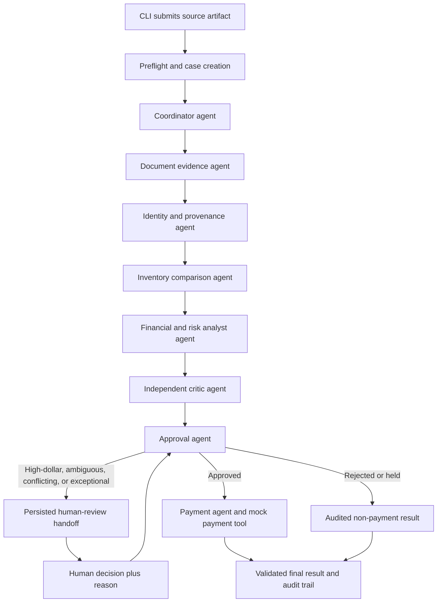

# Galatiq Invoice Processing - Implementation Plan

Prepared: 2026-08-06

Historical status: the original phases and the 2026-08-06 Phase 8 run closed against that day's
candidate; evidence is in [`PHASE8_RECONCILIATION.md`](PHASE8_RECONCILIATION.md). A later
application audit required Tasks 1–16 safety repairs. Those repairs do not inherit the old gate or
paid-provider result. The final integrated checkout still requires the current free release gate,
installed-wheel smoke, publication check, and an explicitly approved paid xAI contract run. Until
those are recorded, the remediated release is **NOT YET VERIFIED**. Runtime databases and result
artifacts remain local and Git-ignored.

## 0. Current application-audit contract

This section supersedes conflicting historical implementation language below:

- sources are streamed into immutable content-addressed snapshots before registration, and every
  later read verifies size/SHA-256 without falling back to the submitted path;
- uploads are byte-bounded and PDF parsing/rendering runs in a killable process with explicit
  timeout, page, CPU, memory, result-size, and crash failures;
- blocking evidence has stable IDs; human mapping/supersession/authorization is limited to exact
  review evidence and commits with inventory aliases in one attached-database transaction;
- a database-issued execution token, generation, and lease fence every evidence, decision,
  terminal, resume, and payment write; payment authorizes and inserts from one transaction-local
  snapshot, and a paid final decision is immutable;
- caller cancellation is exactly `INCOMPLETE / CANCELLED`; provider timeout is exactly
  `FAILED / PROVIDER_TIMEOUT`; startup recovery of an expired nonterminal lease is separately
  `INCOMPLETE / ORPHANED_EXECUTION`, retains existing evidence, and never auto-resumes;
- all UI mutations require session CSRF, same-origin, trusted-host, and response-header controls;
  one application-wide semaphore bounds paid work, and durable submission/source/batch claims make
  ordinary replay and restart behavior idempotent;
- identity-query/database corruption fails rather than becoming a business conflict, and schema
  verification checks exact columns, constraints, triggers, and index order;
- free text is centrally bounded/redacted, tool-call request/execution events correlate by a safe
  normalized ID, and the CLI uses one concise operational-error boundary;
- critique cycles are persisted: required follow-up must be an exact linked second cycle, and no
  third cycle is permitted; responsive keyboard behavior and SSE replay use real anchors and
  monotonic sequence cursors.

## 1. Project outcome

Build a working local Python prototype that processes the supplied invoice files end to end with an AutoGen multi-agent team powered only by xAI Grok 4.5. The prototype will:

1. Extract invoice evidence from PDF, TXT, JSON, CSV, and XML files.
2. Compare normalized line items with an authoritative SQLite inventory database.
3. Recompute and review quantities, line extensions, subtotals, taxes, fees, totals, dates, currencies, duplicate identities, and suspicious signals.
4. Use an independent critique/reflection step before an approval recommendation.
5. Pause for human review on high-dollar or ambiguous/exception cases.
6. Call a local mock payment tool only after a valid approval, while preventing duplicate payment.
7. Produce structured results, an auditable event trail, and clear failure states from a CLI.

The business goal is a trustworthy prototype, not a demo that merely prints plausible success messages.

## 2. Non-negotiable engineering principles

- **There will be NO deterministic gates, guards, or fallback logic that masks failures and makes it look like the system is working when it is not.**
- No alternate model, provider, framework, in-memory database, canned extraction, empty-data substitute, or default approval will be selected automatically when Grok, AutoGen, SQLite, a tool, or a schema fails.
- Deterministic tools are allowed for facts that should be exact: parameterized SQL, `Decimal` arithmetic, file hashing, schema validation, and payment idempotency. Those tools provide evidence; they do not impersonate agent reasoning or convert failures into approvals.
- Operational limits such as timeouts, maximum tool iterations, and bounded retries are circuit breakers only. Reaching one produces `FAILED` or `INCOMPLETE`, never `SUCCEEDED`.
- Business controls such as the high-dollar human-review policy are explicit and audited. They do not replace the agents' analysis, and the original agent recommendation is retained with the human decision.
- No exception will be swallowed. Every tool/model/schema/database failure will retain its error category, case ID, stop reason, and provider request ID when available.
- Every machine-consumed agent response will use a small Pydantic schema. Invalid structured output remains an observable failure; code will not synthesize missing fields or a default decision.
- Every source value will retain provenance: source file, source hash, parser/extractor, raw text or field location, normalization applied, and confidence/ambiguity notes.
- All production code will be typed, clearly organized, well commented, and understandable to a developer who did not build it. Comments and docstrings will explain intent, decisions, failure behavior, and non-obvious tradeoffs.
- `.env` secrets will never be printed, logged, serialized into AutoGen state, checked into Git, or copied into example configuration.

## 3. Discovery findings

### 3.1 Repository and runtime contract

- The README requires a working local CLI prototype with ingestion, validation, approval/reflection, and mock payment stages.
- The current repository contains the README, the invoice fixtures, a PDF-generation helper, and an untracked `.env` containing an `XAI_API_KEY` variable name.
- The README's xAI example is stale: it references `https://grok.x.ai` and `grok-3`. Current xAI documentation uses `https://api.x.ai/v1` and model `grok-4.5`.
- The README says external APIs should be simulated locally, but Grok 4.5 necessarily requires network access to xAI. The plan therefore treats xAI as the only remote runtime dependency; inventory, review state, logging, and payment remain local. If the evaluation environment is fully offline, preflight must fail clearly because no model fallback is permitted.

### 3.2 Invoice corpus

There are 20 artifacts representing 16 invoice numbers:

| Format | Files | Important characteristics |
|---|---:|---|
| TXT | 7 | Clean text, misspelled labels, email-wrapped invoice, relative date, decorated item names, OCR-like `O`/`0` errors |
| JSON | 6 | Nested vendors and line items, original/revision pair, missing fields, negative quantity, repeated items |
| CSV | 3 | One vertical key/value format and two row-oriented table formats with total rows |
| PDF | 3 | Clean table, OCR-like monospaced layout, and repeated-line bulk invoice |
| XML | 1 | Nested header/items/totals and EUR currency |

The corpus is intentionally not one-file-per-invoice:

- `INV-1004` has an original and a revised version.
- `INV-1011`, `INV-1012`, and `INV-1013` each have two representations.
- The system must distinguish a duplicate representation from a newer revision and must never pay either twice.

Known fixture behaviors that should become acceptance tests:

| Invoice | Evidence and expected treatment |
|---|---|
| INV-1001 | Clean, USD 5,000, quantities fit starter inventory |
| INV-1002 | Misspelled fields, USD 15,000, GadgetX 20 vs stock 5, invoice date equals due date despite Net 30 |
| INV-1003 | USD 100,000, FakeItem 100 vs stock 0, relative due date `yesterday`, urgent wire language |
| INV-1004 | Original USD 1,890 and revision R1 USD 5,940; revision/deduplication case |
| INV-1005 | USD 15,225; GadgetX 8 vs stock 5 |
| INV-1006 | Vertical key/value CSV with repeated `item`, `quantity`, and `unit_price` fields |
| INV-1007 | USD 15,525 declared; WidgetA 20 vs 15 and WidgetB 15 vs 10; calculated total is USD 15,635, a USD 110 discrepancy |
| INV-1008 | Email wrapper; unknown SuperGizmo and MegaSprocket; USD 9,900 |
| INV-1009 | Empty vendor, missing due date and terms, quantity -5, total -USD 250, inconsistent subtotal semantics |
| INV-1010 | Decorated `WidgetA (rush order)` plus normal WidgetA; aggregate WidgetA quantity 12 if canonical mapping is approved |
| INV-1011 | TXT/PDF duplicate representation; clean USD 3,000 |
| INV-1012 | TXT/PDF duplicate representation; spelling/OCR-like errors and spaced item aliases; USD 9,975 |
| INV-1013 | JSON/PDF duplicate representation; repeated lines aggregate to WidgetA 22, WidgetB 18, GadgetX 9; USD 22,562.80 declared vs USD 22,512.80 calculated |
| INV-1014 | EUR 4,125; currency-policy/HITL case because the default threshold is denominated in USD |
| INV-1015 | Clean row-oriented CSV; USD 6,500; quantities fit starter inventory |
| INV-1016 | WidgetC is unknown; USD 3,233 |

PDF pages were rendered and visually checked. The displayed PDF content matches the intended clean, OCR-like, and bulk layouts; INV-1013 visibly carries the USD 50 grand-total discrepancy.

### 3.3 SQLite finding

No SQLite database currently exists anywhere in the workspace. The README contains only a proposed setup snippet for `inventory.db`:

```text
inventory(item TEXT PRIMARY KEY, stock INTEGER)
WidgetA -> 15
WidgetB -> 10
GadgetX -> 5
FakeItem -> 0
```

Consequences:

- Actual schema, row counts, nulls, duplicates, indexes, and stored values cannot yet be verified.
- The proposed database can validate existence and stock quantity only. It has no vendor, purchase order, price, tax, currency, payment, or invoice data, so the prototype must not claim that those fields were checked against SQLite.
- Missing or incompatible `inventory.db` must fail preflight. The application must not silently create an in-memory substitute at runtime.
- Repeated item lines must be aggregated before comparison. Per-line checks would incorrectly pass much of INV-1013.
- Exact strings are not enough for `Widget A`, `Gadget X`, or `WidgetA (rush order)`. Candidate aliases may be surfaced, but only evidence-backed alias records or a recorded human decision can establish a canonical SKU.

## 4. Current dependency decision

Use Python 3.12 with these pinned AutoGen packages:

```text
autogen-agentchat==0.7.5
autogen-ext[openai]==0.7.5
```

Use current modular imports from `autogen_agentchat`, `autogen_core`, and `autogen_ext`; do not use legacy AutoGen 0.2/`pyautogen` examples.

AutoGen 0.7.5 is the latest Python release found in the official repository/PyPI, but AutoGen is now in maintenance mode and Microsoft identifies Agent Framework as its successor. The user explicitly requires AutoGen, so this project will remain on AutoGen and record the maintenance risk instead of silently changing frameworks.

Grok client configuration target:

```python
OpenAIChatCompletionClient(
    model="grok-4.5",
    base_url="https://api.x.ai/v1",
    api_key=os.environ["XAI_API_KEY"],
    model_info={
        "vision": True,
        "function_calling": True,
        "json_output": True,
        "family": "unknown",
        "structured_output": True,
    },
    parallel_tool_calls=False,
    reasoning_effort="high",
)
```

Key choices:

- Pin `grok-4.5`, not the moving `grok-4.5-latest` alias.
- Pass `XAI_API_KEY` explicitly because AutoGen's OpenAI client otherwise looks for `OPENAI_API_KEY`.
- Use xAI Chat Completions through AutoGen's OpenAI-compatible client. AutoGen says non-OpenAI endpoints are not tested or guaranteed, so compatibility must be proved before the rest of the build.
- Disable parallel tool calls inside a stateful case team. Process independent invoice cases concurrently at the application level with a fresh team per case and bounded concurrency.
- Use a separate `x-grok-conv-id` per case if prompt caching is enabled; never reuse a conversation ID across invoices.
- Do not use xAI Batch API because Grok 4.5 is not currently supported there.
- Use a documented transient-retry policy only for 429/temporary transport failures. Log every attempt; exhausted retries remain terminal.
- Never pass unsupported reasoning-model parameters such as presence penalty, frequency penalty, or stop sequences if the xAI API rejects them.

## 5. AutoGen orchestration

Use AutoGen AgentChat `Swarm` with model-driven handoff tools. Do not use `SelectorGroupChat`: its documented speaker-selection fallback can choose a previous/first participant when selection fails, which conflicts with the failure-transparency requirement.

Create a fresh team for every invoice case because AutoGen agents are not thread-safe/coroutine-safe and unrelated case histories must remain isolated.



### 5.1 Agent responsibilities

*Amendment (2026-08-06): the shipped design uses one composite deterministic tool per specialist plus two granular read-only critic tools — accepted deviation recorded in [ADR-001](adr/001-composite-agent-tools.md).*

| Agent | Responsibility | Allowed tools |
|---|---|---|
| Case coordinator | Establish work plan, route to specialists, ensure required evidence is requested, hand off without deciding facts it has not checked | Case metadata, handoff tools |
| Document evidence agent | Inspect source format, call parsers/renderers, extract a structured invoice while preserving raw values and ambiguity | File metadata/hash, TXT/JSON/CSV/XML readers, PDF text extraction and page rendering |
| Identity and provenance agent | Compare invoice number/vendor/source hash/revision, detect duplicate representation vs revision, produce an idempotent case identity | Prior-case lookup, source fingerprint lookup, candidate identity lookup |
| Inventory comparison agent | Resolve exact/candidate SKU evidence, aggregate quantities by canonical SKU, query authoritative stock, explain unknown/out-of-stock/excess results | Read-only parameterized SQLite queries, explicit alias lookup, decimal/integer aggregation |
| Financial and risk analyst | Recompute line extensions/subtotal/tax/fees/total, review dates/currency/terms/suspicious wording, distinguish invoice evidence from DB evidence | Decimal calculator, date parser, comparison/delta tool |
| Independent critic | Challenge extraction, mappings, arithmetic, evidence completeness, and the proposed disposition; request another specialist turn when warranted | Read-only case evidence and result retrieval |
| Approval agent | Produce the schema-valid approval/rejection/hold recommendation and create a human-review handoff when policy or evidence requires it | Review-package creation, state handoff |
| Payment agent | Execute the mock payment tool only for an approved case and write the auditable simulated transaction | Approval retrieval, idempotency lookup, mock payment, payment ledger write |

Each agent gets a narrow system message and least-privilege tools. The payment agent will not have source-file or inventory mutation tools; evidence agents will not have payment tools.

### 5.2 Reflection and completion

- The critic must independently review the evidence and recommendation at least once.
- A second specialist/critic pass is allowed when the critic identifies a concrete discrepancy.
- Set explicit maximum tool/message iterations as cost/runaway circuit breakers. If exhausted, mark `INCOMPLETE`; do not accept the latest prose as a final decision.
- Team termination tokens or handoff events only stop the team. `SUCCEEDED` requires a valid final Pydantic result, complete required evidence, a recognized stop reason, and resolved HITL state.

## 6. Tool design

All tools will be annotated Python functions or AutoGen `FunctionTool` instances with strict, small JSON Schemas and structured return models.

### 6.1 Evidence tools

- `get_source_metadata(path)` - canonical path, MIME/extension, size, SHA-256, modification time.
- `read_text_invoice(source_id)` - raw text plus line references.
- `read_json_invoice(source_id)` - parsed object plus JSON-path evidence.
- `read_csv_invoice(source_id)` - table/row evidence without assuming one CSV layout.
- `read_xml_invoice(source_id)` - parsed nodes plus XPath-like evidence.
- `extract_pdf_text(source_id)` - page text with page references.
- `render_pdf_page(source_id, page)` - image evidence when layout/reading order matters.

Parsers return evidence and parse errors; they do not return an approval or quietly repair corrupt content.

### 6.2 Comparison tools

- `lookup_inventory_exact(item_name)` - parameterized, read-only exact lookup.
- `lookup_item_alias(alias)` - only returns explicit alias rows and their provenance.
- `search_inventory_candidates(raw_item)` - produces candidates for agent/human review but never auto-accepts a fuzzy match.
- `aggregate_quantities(lines, canonical_mappings)` - exact aggregate with mapping evidence.
- `compute_invoice_totals(lines, tax, fees)` - `Decimal` calculations and deltas from declared values.
- `find_prior_invoice_candidates(number, vendor, source_hash)` - duplicates, representations, and revisions.

Every DB tool returns one of `OK`, `NOT_FOUND`, `AMBIGUOUS`, `INVALID_INPUT`, or `ERROR`; `ERROR` is never converted to `NOT_FOUND` or a valid comparison.

### 6.3 Workflow tools

- `create_review_request(case_id, evidence, recommendation, reasons)`.
- `record_human_decision(review_id, reviewer, decision, reason)`.
- `mock_payment(case_id, idempotency_key, vendor, amount, currency)`.
- `record_final_result(case_id, result)`.

Mock payment must support injected failures so failure propagation and idempotency can be tested. A duplicate idempotency key returns the prior transaction explicitly; it must never print a second successful payment.

## 7. Structured contracts

Use Pydantic v2 models throughout. Preserve both raw and normalized values.

Core models:

- `SourceArtifact`: ID, canonical path, hash, format, page/row metadata.
- `EvidenceRef`: source ID, page/line/row/JSON path, raw excerpt/value.
- `Money`: `Decimal` amount and ISO 4217 currency.
- `InvoiceLine`: raw item, candidate/canonical SKU, quantity, unit price, declared line total, calculated line total, evidence, ambiguity.
- `ExtractedInvoice`: invoice/vendor/date/due date/terms/currency/lines/totals, missing fields, conflicts, evidence, extraction notes.
- `InventoryComparison`: SKU, aggregate requested quantity, stock, status, evidence.
- `FinancialComparison`: declared/calculated values and deltas.
- `Critique`: supported findings, challenged findings, missing evidence, requested follow-up.
- `ReviewRequest`: reasons, amount/currency, evidence bundle, agent recommendation, requested human action.
- `FinalDecision`: `APPROVE`, `REJECT`, `HOLD`, or `FAILED`; reasons, evidence, reviewer outcome, payment eligibility.
- `CaseResult`: `SUCCEEDED`, `NEEDS_HUMAN`, `FAILED`, or `INCOMPLETE`; stop reason, final decision, payment result, errors, usage.

Do not place unrestricted chain-of-thought in stored schemas. Store concise decision rationale, evidence, tool results, critique findings, and provider metadata sufficient for audit.

## 8. SQLite plan

### 8.1 Authoritative inventory database

Create `inventory.db` through an explicit, versioned setup command, not implicitly during normal processing:

```text
python -m invoice_agents.db migrate --db inventory.db
python -m invoice_agents.db seed --db inventory.db
python -m invoice_agents.db verify --db inventory.db
```

Minimum schema:

- `schema_version(version, applied_at)`
- `inventory(sku PRIMARY KEY, item_name UNIQUE NOT NULL, available_stock INTEGER NOT NULL CHECK available_stock >= 0)`
- `item_aliases(alias_normalized UNIQUE NOT NULL, sku NOT NULL REFERENCES inventory, source, approved_by, approved_at)`

Seed the four README items with stable SKUs. Keep alias rows empty unless a mapping is explicitly part of the test fixture or is approved and recorded by a human.

Preflight will verify file presence, SQLite signature, schema version, required tables/columns/indexes, `PRAGMA integrity_check`, and expected seed identities. Any mismatch stops the case visibly.

Inventory is read-only during initial comparison. Before later adding stock reservations/decrements, the team must choose and document stock semantics: independent invoice validation vs shared inventory commitment. Batch processing without reservations can otherwise overcommit stock.

### 8.2 Workflow/audit database

Use a separate `workflow.db` for mutable prototype state:

- cases and source artifacts
- extraction versions and evidence references
- agent/tool/model events
- comparison and critique results
- human review requests/decisions
- payment idempotency and mock transactions
- AutoGen team state saved only after a run has stopped

Separating authoritative inventory from workflow state makes mutation boundaries and audit responsibilities clear.

The prototype must state plainly that vendor, PO, and price reconciliation are unavailable until authoritative tables are added and seeded. If richer matching is later required, add versioned `vendors`, `purchase_orders`, `purchase_order_lines`, and `price_catalog` tables with explicit source data rather than inferred values.

## 9. Human-in-the-loop policy

Use AutoGen `HandoffTermination(target="human_reviewer")`, persist the stopped team/case state, then resume after a human response. Do not use a blocking `UserProxyAgent` for queued review; AutoGen warns that an active blocked run is unstable and cannot safely be saved.

Default human-review triggers:

- Amount at or above USD 10,000, matching the README's VP-scrutiny example.
- Non-USD invoice when no approved FX/threshold policy exists.
- Multiple plausible invoice identities, revisions, source representations, vendors, SKUs, or aliases.
- Unknown item, zero stock, quantity over stock, negative/zero invalid quantity, or unresolved unit semantics.
- Declared/calculated line, subtotal, tax, fee, or total conflict.
- Missing vendor, invoice number, due date, amount, currency, required evidence, or payment terms when material.
- Relative/invalid/ambiguous dates or OCR ambiguity that can change a business decision.
- Suspicious vendor/payment language, urgent wire instructions, or a material deviation from prior evidence.
- Critic and analyst disagreement after one focused re-review.
- A recoverable tool/model/schema issue for which a human can provide corrective evidence; otherwise the case is `FAILED` for operator repair.

The USD 10,000 threshold will be configuration with currency and effective date, not a magic number embedded in prompts or code. A human review package includes:

- original artifact links/hash and extracted fields
- raw vs normalized/canonical values
- DB rows and aggregate quantity comparisons
- all amount deltas
- duplicate/revision candidates
- agent recommendation and critic findings
- exact questions the human must resolve

The reviewer must choose approve, reject, request correction, or establish a mapping/revision decision and supply a reason. Store reviewer identity/time and retain the pre-review agent conclusion.

## 10. Failure and observability model

### 10.1 Explicit status semantics

| Status | Meaning |
|---|---|
| `SUCCEEDED` | Valid final structured decision exists, required evidence is complete, HITL is resolved, and any approved payment has a valid mock transaction result |
| `NEEDS_HUMAN` | Team intentionally stopped with a persisted, valid review request |
| `FAILED` | Authentication, provider, database, tool, schema, payment, or unrecoverable evidence failure prevented a trustworthy result. Provider timeout is exactly `FAILED / PROVIDER_TIMEOUT`. |
| `INCOMPLETE` | Caller cancellation (`CANCELLED`), expired-lease recovery (`ORPHANED_EXECUTION`), or another named interruption/circuit breaker stopped the workflow. Neither cancellation nor orphan recovery is a provider timeout. |

Rejection is a successful workflow outcome with `FinalDecision=REJECT`; it is not a technical failure and does not call payment.

### 10.2 Required telemetry

- Stream AutoGen events with `run_stream()`.
- Persist model requests metadata, tool call/result events, handoffs, agent messages, critique, stop reason, token usage, latency, retries, and human actions.
- Use AutoGen `EVENT_LOGGER_NAME`/`TRACE_LOGGER_NAME` and OpenTelemetry spans for runtime, agent, model, and tool activity.
- Correlate every event with case ID, source ID/hash, agent name, tool-call ID, DB evidence ID, review ID, and payment ID.
- Redact the API key and sensitive headers. Do not log full `.env`, authorization headers, or unrestricted invoice text in telemetry intended for external backends.
- Record xAI request IDs and the Zero Data Retention response header status when available, without storing credentials.
- Save AutoGen state only after the team stops; saving a running team can produce inconsistent state.

## 11. Compatibility spike - first implementation work

AutoGen 0.7.5 predates Grok 4.5, and its official client does not guarantee non-OpenAI providers. Before building the invoice workflow, create a small contract-test suite that proves:

1. Authentication and a basic Grok 4.5 Chat Completion through `OpenAIChatCompletionClient`.
2. Exact model ID and base URL; no alias/provider fallback.
3. One typed function call and result round trip.
4. Multiple sequential tool iterations with parallel tool calls disabled.
5. Pydantic structured output.
6. Structured output after tool use/reflection.
7. Swarm handoff between agents.
8. `HandoffTermination`, stopped-state save, reload, human message, and resume.
9. Tool exception propagation.
10. Invalid/unsupported JSON Schema behavior.
11. Missing/invalid key, 401, 429, timeout, and exhausted retry visibility.
12. Event logging, token usage, request ID, and OpenTelemetry capture.
13. Agent-name compatibility; if xAI rejects the `name` field, explicitly test and document `include_name_in_message=False` with `add_name_prefixes=True` as the chosen configuration, not a runtime fallback.
14. PDF-derived image input only if the extraction agent will use Grok vision.

If this spike fails, stop the project at a documented blocking result. Do not automatically call xAI directly, change model, change framework, or return mocked LLM success. A first-class custom xAI `ChatCompletionClient` adapter may be proposed as a separate, reviewed design change while preserving AutoGen orchestration; it must not appear as silent runtime fallback behavior.

## 12. Proposed project layout

```text
.
|-- main.py
|-- pyproject.toml
|-- uv.lock
|-- .env.example
|-- .gitignore
|-- README.md
|-- IMPLEMENTATION_PLAN.md
|-- migrations/
|   |-- inventory/
|   `-- workflow/
|-- src/invoice_agents/
|   |-- config.py
|   |-- cli.py
|   |-- models.py
|   |-- orchestration.py
|   |-- agents/
|   |-- tools/
|   |-- db/
|   |-- hitl/
|   |-- observability/
|   `-- payment/
|-- tests/
|   |-- contract/
|   |-- unit/
|   |-- integration/
|   |-- failure_transparency/
|   `-- fixtures/
`-- data/invoices/
```

Module and tool boundaries will be documented in the README. Public functions/classes receive docstrings, all code receives type hints, and non-obvious orchestration, normalization, failure, HITL, and idempotency behavior receives explanatory comments. Avoid clever metaprogramming and overly broad utility modules.

## 13. Implementation phases

### Phase 0 - Baseline and compatibility

- Add `.gitignore` before any secret-sensitive work; keep `.env` untracked.
- Create `pyproject.toml`, lock file, config model, `.env.example`, logging redaction, and provider preflight.
- Implement and run the AutoGen/Grok compatibility suite in Section 11.
- Exit criterion: every required contract is proven or the project reports a precise blocker. No invoice implementation begins on assumed compatibility.

### Phase 1 - Database setup and verification

- Add versioned migrations and explicit migrate/seed/verify commands for `inventory.db` and `workflow.db`.
- Seed only the README inventory facts.
- Add integrity, schema, constraint, read-only query, and missing/corrupt DB tests.
- Exit criterion: DB setup is repeatable; normal runtime fails loudly for missing/incompatible DB; no in-memory substitute exists.

### Phase 2 - Evidence ingestion

- Implement format detection, metadata/hash, TXT, JSON, CSV, XML, and PDF tools.
- Preserve raw values/locations and build format-specific unit tests.
- Add optional PDF page rendering for layout evidence without treating successful OCR/text extraction as visual proof.
- Exit criterion: all 20 artifacts yield either a schema-valid extraction with evidence or an explicit extraction failure/ambiguity.

### Phase 3 - Identity and comparison tools

- Add duplicate/revision candidate lookup, explicit alias evidence, quantity aggregation, inventory lookup, and `Decimal` total recomputation.
- Implement typed tool status semantics and test error propagation.
- Exit criterion: known stock, alias, duplicate, repeated-line, currency, and arithmetic fixtures produce the expected evidence; no tool returns an approval.

### Phase 4 - AutoGen team and critique loop

- Define agent prompts, tool permissions, handoffs, structured outputs, stop conditions, and circuit breakers.
- Create a fresh Swarm per case and use bounded application-level concurrency.
- Add the independent critic and focused re-review loop.
- Exit criterion: one clean, one ambiguous, one high-dollar, and one failing case traverse the expected states with complete event history.

### Phase 5 - Persisted HITL

- Implement review request persistence, CLI review queue/list/show/decide commands, stopped team-state save, and resume.
- Enforce high-dollar human confirmation and edge-case review with explicit reasons.
- Exit criterion: approve, reject, correction, timeout, and resume paths are tested; no blocked `UserProxyAgent` state is used for queued review.

### Phase 6 - Mock payment and idempotency

- Implement the payment agent, mock payment tool, transaction ledger, duplicate-key behavior, and injected failure tests.
- Ensure rejected/held/failed/unresolved cases cannot produce a successful payment event.
- Exit criterion: approved clean invoice pays exactly once; duplicate artifact/retry/revision and tool-failure scenarios remain auditable and never double-pay.

### Phase 7 - End-to-end UX and documentation

- Support the README-style command:

  ```text
  python main.py --invoice_path=data/invoices/invoice_1001.txt
  ```

- Add batch/case/review/status commands without hiding per-case failures.
- Print a concise human result plus write full structured JSON/event records.
- Update README with setup, DB initialization, architecture, status meanings, HITL flow, troubleshooting, data/privacy caveats, and demo scenarios.
- Exit criterion: a new developer can set up, run, review, resume, test, and explain the system from the documentation.

### Phase 8 - Final verification and presentation

- Run static checks, type checks, unit/contract/integration/failure tests, and the complete invoice corpus.
- Reconcile expected case matrix to actual outputs and review all exceptions.
- Produce a short business-facing demo narrative showing faster handling while making uncertainty and failures visible.
- Exit criterion: all acceptance criteria below pass, or remaining failures are reported accurately with no claim of completion.

## 14. Test strategy

### 14.1 Unit tests

- Each parser and source locator.
- Money/date/quantity models and raw-value preservation.
- `Decimal` arithmetic and tax/fee deltas.
- Exact lookup, alias evidence, aggregate quantities, unknown/zero/excess stock.
- Duplicate/revision identity and payment idempotency.
- Logging redaction and status mapping.

### 14.2 Contract tests

- AutoGen 0.7.5 with live `grok-4.5` for tools, structured output, handoffs, state, and telemetry.
- xAI error classes, rate limits, reasoning settings, and agent-name compatibility.
- SQLite schema/integrity/read-only behavior.

Live tests are opt-in because they use the API and incur cost; skipping them must not be reported
as a passing live contract. Historical results do not reverify a changed release candidate.

### 14.3 Integration/golden cases

- Run every fixture in Section 3.2.
- Test the paired TXT/PDF and JSON/PDF artifacts as duplicate representations.
- Test original vs revised INV-1004.
- Test aggregate stock on INV-1013.
- Test calculation discrepancies on INV-1007 and INV-1013.
- Test missing fields/negative amount on INV-1009.
- Test non-USD INV-1014.
- Test high-dollar HITL on INV-1002, 1003, 1005, 1007, and 1013.

### 14.4 Failure-transparency tests

Explicitly prove that these never become success:

- missing/empty/invalid `XAI_API_KEY`
- unavailable xAI network, 401, 429 exhaustion, timeout, malformed response
- unsupported structured schema or Pydantic validation failure
- missing/corrupt/locked/wrong-version SQLite DB
- SQL/tool exception or malformed tool result
- unreadable/truncated/corrupt source file
- unknown or ambiguous format
- max-message/max-tool-iteration termination
- human review left unresolved
- mock payment exception
- duplicate payment attempt

Assertions must verify status, stop reason, original error preservation, absence of a payment success event, and absence of a misleading success summary.

## 15. Acceptance criteria

- AutoGen 0.7.5 actually orchestrates multiple Grok 4.5 agents; no single-agent script is presented as multi-agent.
- Every agent uses tool calls and structured output where appropriate.
- All 20 input artifacts are exercised.
- SQLite comparisons cite the exact queried row or explicitly state that no match/data exists.
- Repeated SKU quantities are aggregated before stock comparison.
- Duplicate representations and revisions do not create duplicate payments.
- High-dollar and edge cases pause with a complete human-review package.
- Human decisions resume the stopped case and remain in the audit trail.
- Critic findings and original agent recommendations remain visible.
- Approved invoices call the mock payment tool exactly once; rejected/held/failed cases do not.
- Technical failure, uncertainty, and policy hold are distinguishable in CLI output and stored JSON.
- Secrets are absent from Git, logs, state snapshots, and test artifacts.
- The final integrated candidate passes formatting, linting, strict type checking, the free suite,
  browser smoke, dependency audit, package checks/build, and fresh-wheel smoke. This remains a
  pending acceptance item until command evidence is attached.
- The codebase contains helpful module/class/function docstrings and comments explaining orchestration, tool boundaries, normalization, error propagation, HITL, and idempotency.
- README instructions allow another developer to understand and run the system without private context.

## 16. Decisions requiring human confirmation before production use

The prototype can use the defaults above, but the following are business/compliance decisions, not facts the agents should invent:

- Whether USD 10,000 is the final high-dollar threshold and how thresholds work by currency/effective date.
- Who may approve, reject, establish aliases, or supersede a prior invoice revision.
- Whether stock is a per-invoice validation reference or must be reserved/decremented across a batch.
- Whether and how vendor, PO, price, tax, and bank-account master data will be added.
- Which source wins when paired representations disagree.
- Whether xAI's default data-retention terms and US serving regions are acceptable for invoice content, and whether Zero Data Retention is required.
- What telemetry may leave the machine and how long local audit records are retained.

## 17. Documentation reviewed

AutoGen:

- [Official AutoGen repository and maintenance notice](https://github.com/microsoft/autogen)
- [Python releases](https://github.com/microsoft/autogen/releases)
- [Installation and current package names](https://microsoft.github.io/autogen/stable/user-guide/agentchat-user-guide/installation.html)
- [OpenAI-compatible model client](https://microsoft.github.io/autogen/stable/reference/python/autogen_ext.models.openai.html)
- [Swarm orchestration](https://microsoft.github.io/autogen/stable/user-guide/agentchat-user-guide/swarm.html)
- [AssistantAgent tools and structured output](https://microsoft.github.io/autogen/stable/user-guide/agentchat-user-guide/tutorial/agents.html)
- [Human-in-the-loop](https://microsoft.github.io/autogen/stable/user-guide/agentchat-user-guide/tutorial/human-in-the-loop.html)
- [Termination conditions](https://microsoft.github.io/autogen/stable/user-guide/agentchat-user-guide/tutorial/termination.html)
- [Managing state](https://microsoft.github.io/autogen/stable/user-guide/agentchat-user-guide/tutorial/state.html)
- [Tracing and observability](https://microsoft.github.io/autogen/stable/user-guide/agentchat-user-guide/tracing.html)

xAI:

- [Grok 4.5 model details](https://docs.x.ai/developers/models/grok-4.5)
- [Grok 4.5 API overview](https://docs.x.ai/developers/grok-4-5)
- [Function calling](https://docs.x.ai/developers/tools/function-calling)
- [Structured outputs](https://docs.x.ai/developers/model-capabilities/text/structured-outputs)
- [Reasoning](https://docs.x.ai/developers/model-capabilities/text/reasoning)
- [Rate limits](https://docs.x.ai/developers/rate-limits)
- [Batch API](https://docs.x.ai/developers/advanced-api-usage/batch-api)
- [Data and privacy](https://docs.x.ai/developers/faq/security)

The xAI Grok 4.5 overview reviewed for this plan reports a last-updated date of July 17, 2026.
