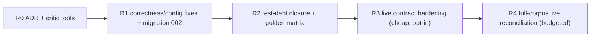

# Galatiq Invoice Processing - Gap Remediation Plan

Prepared: 2026-08-06

Status: **R0-R4 executed and verified, 2026-08-06 - this plan is complete** (see
[Changelog](#9-changelog) for evidence and recorded deviations; Phase 8 completion evidence in
[`PHASE8_RECONCILIATION.md`](PHASE8_RECONCILIATION.md)). This plan addresses the gaps found in the 2026-08-06 review of
the implementation against [`IMPLEMENTATION_PLAN.md`](IMPLEMENTATION_PLAN.md). The review confirmed
the system is real and its verification claims are truthful; the items below are the deviations,
thin spots, and loose ends that remained. It is written so the work can be executed in order,
stopped after any phase, and audited afterward.

> **Historical scope:** Completion here applies to the 2026-08-06 candidate only. The later
> application-audit remediation supersedes conflicting operational claims. This plan's historical
> gate and paid-provider run are not evidence for the current integrated release.

Related documents: [`IMPLEMENTATION_PLAN.md`](IMPLEMENTATION_PLAN.md) (original plan),
[`UI_PLAN.md`](UI_PLAN.md) (UI work - independent of this plan, but R1 items below reduce UI rework).

## 1. Gap inventory

| ID | Gap | Plan section violated | Severity | Phase |
|---|---|---|---|---|
| G1 | Full-corpus live reconciliation (Phase 8) never executed; only INV-1001 and INV-1002 ran live | §13 Phase 8 exit criterion | High | R4 |
| G2 | Composite one-tool-per-agent design instead of the documented granular per-agent tools | §5.1, §6 | Medium (decision) | R0 |
| G3 | Business tolerances embedded in the critic prompt (3-day Net-terms allowance; ignore empty `canonical_sku`) | §2, §9 ("threshold ... not a magic number embedded in prompts") | High | R1 |
| G4 | `InvoiceLine.canonical_sku` / `candidate_skus` never populated; mapping evidence lives only in comparison payloads | §7 | Medium | R1 |
| G5 | Critic/analyst disagreement never triggers human review | §9 trigger list | Medium | R1 |
| G6 | `ESTABLISH_MAPPING` / `SUPERSEDE_REVISION` force `APPROVE` on resume without re-running inventory comparison against the new alias | §3.3, §9 | High | R1 |
| G7 | Compatibility spike thinner than §11's 14 items (model ID not server-echoed; 401/telemetry/schema checks degraded to local) | §11 | Medium | R3 |
| G8 | Untested guards: max-message→`INCOMPLETE` mapping, unresolved-review block, locked DB, malformed provider response | §14.4 | Medium | R2 |
| G9 | No `tests/integration/` tier; local golden matrix (expected treatment per fixture) not asserted end-to-end deterministically | §12, §14.3 | Medium | R2 |
| G10 | Dead/unwired code: `render_pdf_page` unreachable; `UsageSummary.retries` never incremented | §6.1, §10.2 | Low | R1 |
| G11 | CLI prints `artifacts/results/{case_id}.json` for preflight/prepare failures where no file was written | §13 Phase 7 ("Print a concise human result plus write full structured JSON") | Low | R1 |
| G12 | `"max" in stop_reason.lower()` is an over-broad `INCOMPLETE` match; `verify_database` lists but does not verify required indexes | §10.1, §8.1 | Low | R1 |
| G13 | Repo hygiene: `workflow_e2e*.db` clutter at root; `.gitignore` carries unrelated Node/Expo sections | - | Low | R1 |

Non-negotiable constraint carried over from the original plan: **no remediation may add a fallback,
default decision, or failure-masking path.** Every fix below either moves policy into configuration,
adds a deterministic check, adds a test, or completes work the plan already required.

## 2. R0 - Architecture decision record for tool granularity (G2)

The implemented design gives each specialist agent one composite deterministic tool
(`extract_and_record_invoice`, `compare_and_record_inventory`, `analyze_and_record_financial_risk`)
instead of the granular tools named in §5.1/§6.1-6.2. The granular functions exist but only as
internal Python.

**Recommendation: formally accept the composite design, with one targeted exception (below), and
record it as an ADR rather than retrofitting granular tools.**

Rationale for acceptance:

- The composite design is cheaper (fewer model round trips), reduces the surface for malformed tool
  arguments, and passed live end-to-end verification.
- It does not violate the §2 principles: deterministic tools still provide evidence and do not
  convert failures into approvals. The deviation is documentation drift, not a safety regression.
- Retrofitting ~12 granular agent tools would add roughly 2-4x model calls per case for no new
  evidence, and every prompt would need re-tuning and re-verification live.

The targeted exception: the **independent critic** is the one agent whose value depends on being
able to check work rather than narrate it. Give the critic two read-only granular tools:

- `recheck_inventory_item(item_name)` → wraps `InventoryReader.lookup_inventory_exact` +
  `lookup_item_alias` (read-only, exact row evidence).
- `recompute_line(quantity, unit_price)` → exact `Decimal` multiplication, no state.

Deliverables:

1. `Docs/adr/001-composite-agent-tools.md` recording the decision, the rejected alternative, and
   the cost comparison, cross-referenced from `IMPLEMENTATION_PLAN.md` §5.1 (one-line amendment
   noting the accepted deviation) and the README module table.
2. The two critic tools added to `build_team`, with unit tests for both underlying functions and a
   prompt line telling the critic they exist.

Exit criterion: plan, README, and code agree on the tool architecture; the critic can
independently re-derive at least one inventory row and one line extension in a live case.

## 3. R1 - Correctness and configuration fixes

### 3.1 Move date-tolerance policy out of the critic prompt (G3, part 1)

Current: `agents/team.py` critic system message contains "Allow up to three calendar days around
stated Net terms for inclusive/weekend convention". This is a business tolerance living in a prompt,
exactly what §9 forbids for the dollar threshold.

Fix:

1. Add to `Settings`: `due_date_tolerance_days: int = Field(default=3, ge=0, le=10)`
   (`INVOICE_DUE_DATE_TOLERANCE_DAYS` in `.env.example`, with the same "business policy" comment
   block as the review threshold).
2. Add a deterministic terms-consistency check in `build_risk_assessment`: parse `Net N` from
   normalized `payment_terms`; when both dates parsed, compute
   `expected_due = invoice_date + N days`; if `abs(actual_due - expected_due) >
   due_date_tolerance_days`, append a review reason stating the expected date, actual date, delta,
   and the configured tolerance. (The existing `due <= invoice_date` check stays.)
3. Delete the tolerance sentence from the critic prompt.

Note: this check makes INV-1002's "invoice date equals due date despite Net 30" flag through two
independent reasons (ordering + terms mismatch); the golden matrix in R2 asserts both.

### 3.2 Populate `canonical_sku` and remove the prompt band-aid (G3 part 2, G4)

Current: `InvoiceLine.canonical_sku` and `candidate_skus` are never written anywhere; the critic
prompt is instructed to ignore that inconsistency.

Fix (versioned re-extraction, preserving immutability of v1 evidence):

1. In the `compare_and_record_inventory` tool, after `resolve_mappings` succeeds, build an updated
   `ExtractedInvoice` where each line carries `canonical_sku` from an explicit mapping
   (`exact_item_name` / `approved_alias` / `human_decision` only) and `candidate_skus` from the
   unresolved lookup's fuzzy candidates. Persist it with the existing `save_extraction` versioning
   (it becomes v2; v1 remains the raw-extraction audit record).
2. Delete the "canonical_sku is empty" sentence from the critic prompt.
3. Unit tests: after comparison of `invoice_1001.txt`, v2 lines carry `SKU-WIDGET-A`/`SKU-WIDGET-B`;
   after `invoice_1010.txt`, the `WidgetA (rush order)` line has `canonical_sku=None` and non-empty
   `candidate_skus`; extraction version count is 2.

### 3.3 Critic-disagreement review trigger (G5)

Current: review triggers are exactly the deterministic `policy_review_reasons`; a critic who
recommends `REJECT`/`HOLD` cannot stop an agent `APPROVE`.

Fix: as part of the decision-rules extraction in 3.4, add the rule: **`APPROVE` requires either
`critique.recommended_disposition == APPROVE` or a resolved authorizing human decision.** If the
critic disagreed and no human has ruled, `submit_final_decision` raises
(`stop_reason="CRITIC_DISAGREEMENT_UNRESOLVED"`), and the approval agent's prompt directs it to
`persist_human_review` in that situation with the disagreement stated in the rationale. The
original agent recommendation and the critique both remain visible in the review package (§9
requirement), and the reverse direction (critic `APPROVE`, agent `REJECT`/`HOLD`) stays allowed -
the stricter disposition never needs escalation.

### 3.4 Extract decision rules into a testable module (enables G8 tests)

Current: the guard logic (policy-review-unresolved, human-agent conflict, payment-eligibility
consistency) lives inside the `submit_final_decision` closure in `build_team` and cannot be unit
tested.

Fix: new module `src/invoice_agents/agents/decision_rules.py` with a pure function:

```text
validate_final_decision(
    selected: DecisionKind,
    payment_eligible: bool,
    risk: RiskAssessment,
    critique: Critique,
    review: ReviewRequest | None,
) -> None   # raises InvoiceAgentsError with the existing stop reasons
```

The closure becomes a thin adapter (load state → call → persist). All existing stop reasons
(`HUMAN_REVIEW_UNRESOLVED`, `HUMAN_AGENT_DECISION_CONFLICT`, `FINAL_DECISION_INVALID`) plus the new
`CRITIC_DISAGREEMENT_UNRESOLVED` are raised from here. Behavior is unchanged except for 3.3.

### 3.5 Re-verify evidence after authorizing human decisions (G6)

Current: an `ESTABLISH_MAPPING` or `SUPERSEDE_REVISION` decision forces the agent to `APPROVE` on
resume, even though the inventory comparison was never recomputed against the newly approved alias,
and other blocking evidence may remain.

Fix, in two parts:

1. **Deterministic recompute before resume.** In `resume_case`, when the human decision is
   `ESTABLISH_MAPPING`, re-run `compare_inventory` + `compute_invoice_totals` +
   `build_risk_assessment` (no model calls) against the updated alias table before the team is
   resumed, persisting fresh comparison/risk records and the v3 extraction (per 3.2). The resumed
   approval agent sees current evidence, and the audit trail shows recompute events between the
   human decision and the final decision.
2. **Soften "authorizing forces APPROVE" into "authorizing permits APPROVE".** In
   `validate_final_decision`: an authorizing human decision satisfies the human-review requirement
   for `APPROVE`, but if the recomputed `policy_review_reasons` still contain blocking evidence
   that the recorded decision's reason does not address (any `EXCEEDS_STOCK` / `OUT_OF_STOCK` /
   `UNKNOWN` / `INVALID_QUANTITY` inventory status, or a nonzero total delta), the agent may
   instead `HOLD` with a **second** review request. Forcing `REJECT` after an authorizing decision
   remains a conflict, as today.
3. **Schema migration `002_review_sequence.sql` (workflow):** `review_requests.case_id` is
   currently `UNIQUE`, which structurally forbids a second review cycle. Recreate the table without
   the unique constraint, add `sequence INTEGER NOT NULL` with `UNIQUE(case_id, sequence)`, bump
   `SCHEMA_VERSION` to 2, and update `verify_database`, `load_case_review` (latest by sequence),
   and `list_reviews`. Migration tests cover upgrading a populated v1 database and rejecting a
   v1 database at preflight until migrated.

This is the largest R1 item; it touches orchestration, rules, store, and a migration. It is also
the one that most changes observable behavior, so its tests land in the same commit: a fixture
where a mapping decision resolves the only blocker (case proceeds to `APPROVE`), and one where
stock still exceeds after mapping (case produces review #2, status `NEEDS_HUMAN` again).

### 3.6 Small fixes (G10, G11, G12, G13)

- **`render_pdf_page` wiring (G10a):** call it from `create_review_request` for PDF sources -
  render page 1 (and any page count ≤ 3, all pages) under `artifacts/reviews/{review_id}/`, and
  include the returned paths + hashes in `evidence_bundle["rendered_pages"]`. §9 requires the
  review package to carry original-artifact evidence; this makes the layout evidence real. Unit
  test with `invoice_1011.pdf`. (The UI plan's review screen then shows these images for free.)
- **`UsageSummary.retries` (G10b):** in `run_prepared_case`/`resume_case`, after the stream ends,
  set `usage.retries` from `SELECT COUNT(*) FROM events WHERE case_id=? AND
  event_type='provider.retry'` via a new `WorkflowStore.count_events` helper. Unit test seeds two
  retry events and asserts the count lands in the result.
- **Result path honesty (G11):** call `_write_result` on every terminal path, including preflight
  and prepare failures in `process_invoice`/`process_batch`, so the printed
  `full_result=artifacts/results/...` line is always true. Test: missing-key run produces the JSON
  file with `status=FAILED`.
- **Precise `INCOMPLETE` matching (G12a):** replace the `"max" in stop_reason.lower()` clause with
  an exact match on AutoGen's `MaxMessageTermination` stop-reason phrasing ("maximum number of
  messages"), asserted by a unit test pinned to the installed AutoGen version so an upgrade that
  changes the phrasing fails the test instead of silently misclassifying.
- **Index verification (G12b):** `verify_database` gains a required-index set per database kind
  (the names created in the migrations) and raises `DATABASE_SCHEMA_MISMATCH` when one is missing.
  Test drops an index and asserts the failure.
- **Hygiene (G13):** move the two `workflow_e2e*.db` verification databases to
  `artifacts/verification/` (path stays gitignored) with a README line explaining what they prove;
  trim the Node/Expo/mobile blocks from `.gitignore`. No history rewrite - the files were never
  tracked.

### R1 exit criterion

`ruff format --check`, `ruff check`, `mypy --strict`, and the full local suite pass; the critic
prompt contains no numeric business tolerances and no schema workarounds; schema version 2
verifies; a mapping decision demonstrably re-verifies evidence before any approval.

## 4. R2 - Test-debt closure (G8, G9)

New tests, all local and free:

| Test | Asserts |
|---|---|
| `test_max_messages_maps_to_incomplete` | A `TaskResult` with the max-message stop reason yields `CaseStatus.INCOMPLETE`, `MAX_MESSAGES_EXHAUSTED`, no final decision, no payment |
| `test_unresolved_review_blocks_final_decision` | `validate_final_decision` raises `HUMAN_REVIEW_UNRESOLVED` when `policy_review_reasons` is non-empty and review is pending/absent |
| `test_critic_disagreement_blocks_approve` | Critic `HOLD`/`REJECT` + agent `APPROVE` + no human → `CRITIC_DISAGREEMENT_UNRESOLVED` |
| `test_locked_database_fails_visibly` | With a second connection holding `BEGIN EXCLUSIVE`, store writes and `verify_database` surface `DATABASE`-category errors within the 5s busy timeout; never `NOT_FOUND`, never success |
| `test_malformed_provider_response_categorized` | `openai.APIResponseValidationError` (and a `json.JSONDecodeError` from a stubbed client) map to `PROVIDER`/`SCHEMA` categories with preserved messages - extend `_error_record` with an explicit `APIResponseValidationError` branch |
| `test_payment_ledger_write_failure` | `mock_payment` against a read-only workflow DB raises; no `PAID` result object exists afterward |

**Integration tier (G9):** new `tests/integration/test_golden_matrix.py` running the full
deterministic pipeline (prepare → extraction → identity → comparison → totals → risk) per fixture
against freshly migrated temp databases - no model calls - asserting the §3.2 expected-treatment
matrix:

- review-triggering fixtures (at minimum 1002, 1003, 1005, 1007, 1008, 1009, 1010, 1013 both, 1014,
  1016) produce the specific expected reason categories (threshold / stock / unknown item /
  discrepancy / missing fields / currency / suspicious language / relative date);
- clean fixtures (1001, 1015, first-seen 1011, 1006 if clean) produce zero policy reasons;
- sequenced pairs: 1011 txt→pdf yields `DUPLICATE_REPRESENTATION`; 1004 original→revised yields
  `POSSIBLE_REVISION`; 1013 json→pdf yields an identity candidate plus the USD 50 delta;
- the INV-1002 terms check from R1 §3.1 fires.

This matrix is the local half of Phase 8's reconciliation; R4 provides the live half. Also add the
`tests/fixtures/` directory from §12 for the synthetic corrupt/locked/malformed inputs these tests
need, rather than generating them inline.

Exit criterion: every §14.4 scenario has a named test or a written justification in this document's
changelog; local suite still completes in well under a minute.

## 5. R3 - Compatibility-contract hardening (G7)

Additions to `run_live_contracts` (opt-in, paid, cheap - roughly 15-20 small calls):

1. **Server-echoed model identity:** one direct `openai.AsyncOpenAI` chat call (test-only; not a
   runtime path) asserting `response.model` starts with `grok-4.5` and capturing
   `x-request-id` from raw response headers as evidence. This closes §11 item 2 properly instead of
   asserting our own constants back at ourselves.
2. **Live 401 visibility:** a deliberately invalid key (`sk-invalid-contract-probe`) must produce
   `openai.AuthenticationError` mapped to `AUTHENTICATION`/`PROVIDER_AUTHENTICATION_FAILED` with a
   provider request ID when the response carries one. Rejected auth calls are unbilled or
   negligible.
3. **Telemetry capture:** run one probe under an in-memory OTel span exporter and assert spans for
   the model call exist and carry the case/agent attributes; assert `usage.prompt_tokens > 0`
   flows into `UsageSummary` via the streaming path.
4. **Structured-output rejection, live:** send an intentionally unsupported response schema and
   assert the failure is an explicit error, not silent prose acceptance (§11 item 10's live half).
5. **Documented residuals:** add a `Docs/adr/002-contract-scope.md` note stating that 429
   exhaustion and timeout classes remain synthetically tested (deliberately triggering them live is
   unreliable and costly) - so the "degraded to local" state becomes a recorded decision instead of
   an omission.

Exit criterion: `uv run invoice-agents contract --live` prints the expanded matrix with all checks
`PASS`; the two ADRs enumerate exactly which §11 items are proven live vs locally and why.

## 6. R4 - Full-corpus live reconciliation (completes Phase 8 / G1)

Run last, on the fully remediated system, because it is the only step that costs meaningful money
and its results are the durable completion evidence for the original plan.

### 6.1 Budget and mechanics

Observed live costs: successful cases ran 35k-47k prompt + ~2k completion tokens across 18 model
calls; `INCOMPLETE` runs ~21-25k. Estimate for the full corpus: 20 cases ≈ **0.8-1.0M prompt
tokens**, plus ~8-12 HITL resumes at ~10-20k each, plus the R3 contract suite. Confirm the token
budget against the current xAI rate card before starting (decision D4 below).

Mechanics:

- Fresh `workflow.db` (archive the current one to `artifacts/verification/`), verified inventory DB,
  `INVOICE_MAX_MESSAGES=40`.
- `uv run invoice-agents batch --invoice-dir data/invoices --concurrency 2`, respecting xAI rate
  limits.
- Work the review queue with a named human reviewer using the decision script in 6.2 (decisions are
  the operator's to make at run time; the script records the *expected* decision so deviations are
  conscious).
- Resume every decided case; re-run `batch` is never used to retry - failed cases are investigated
  individually.

### 6.2 Expected reconciliation matrix

The acceptance artifact is `Docs/PHASE8_RECONCILIATION.md`: one row per artifact - expected
treatment (below) vs actual status, decision, review reasons, payment - with every deviation
explained or filed as a defect. Expected treatment, from plan §3.2 and the R1/R2 policy state:

| Artifact | Expected path |
|---|---|
| 1001.txt | Clean → `APPROVE` → `PAID` |
| 1015.csv | Clean → `APPROVE` → `PAID` |
| 1011.txt (first) | Clean → `APPROVE` → `PAID` |
| 1011.pdf (second) | Identity candidate → review → reviewer confirms duplicate → no second payment (`DUPLICATE` if approval is recorded, or `REJECT` as duplicate) |
| 1002.txt | Threshold + stock + terms → review → expected `REJECT` |
| 1003.txt | Threshold + unknown/zero stock + relative date + wire language → review → `REJECT` |
| 1004.json then 1004_revised.json | Original processes (small, clean → likely `APPROVE`/`PAID`); revision → `POSSIBLE_REVISION` review → `SUPERSEDE_REVISION`; idempotency key forbids a second payment - reconciliation records the documented adjustment-design limitation |
| 1005.json | Threshold + GadgetX 8>5 → review → `REJECT` |
| 1006.csv | Vertical CSV; expect review for missing terms/currency convention unless evidence is clean → record actual |
| 1007.csv | USD 110 discrepancy → review → `REJECT` or `REQUEST_CORRECTION` |
| 1008.txt | Unknown items → review → `REJECT` |
| 1009.json | Negative quantity/amount, missing fields → review → `REJECT` |
| 1010.txt | `WidgetA (rush order)` unresolved → review → `ESTABLISH_MAPPING` → recompute (aggregate 12 ≤ 15) → `APPROVE` → `PAID` - this exercises the new G6 path end to end |
| 1012.txt / 1012.pdf | OCR ambiguity → review; second is identity candidate; no double payment |
| 1013.json / 1013.pdf | Aggregate stock exceedances + USD 50 delta → review → `REJECT`; second representation flagged |
| 1014.xml | EUR, no FX policy → review → operator decision (expected `REJECT`/`HOLD`) |
| 1016.json | Unknown WidgetC → review → `REJECT` |

### 6.3 Exit criteria

- All 20 artifacts have a terminal or resolved-and-resumed state; none required code changes to
  finish (any that do restart R4 after the fix).
- Payments ledger contains exactly the expected `PAID` rows (target: 1001, 1015, 1011-first,
  1010 post-mapping, 1004 per the operator's revision ruling) and zero double payments.
- `PHASE8_RECONCILIATION.md` is complete, deviations explained, and linked from the README; the
  `IMPLEMENTATION_PLAN.md` status header is updated to state that Phase 8 is closed.

## 7. Decisions required before or during execution

| ID | Decision | Owner | Default if unanswered |
|---|---|---|---|
| D1 | Accept the composite-tool ADR (R0) or mandate the granular retrofit | Michael | Accept composite + critic tools |
| D2 | Approve the G6 behavior change (authorizing decisions permit rather than force `APPROVE`; second review cycles become possible) | Michael | Proceed as specified |
| D3 | Confirm `due_date_tolerance_days=3` as the configured business default | Michael | 3 days |
| D4 | Approve the R4 token budget (~1M tokens + resumes) and pick the run window | Michael | Blocked until approved |
| D5 | 1014 (EUR) run-time ruling: reject, or hold pending an FX policy | Reviewer at run time | Operator's call, recorded with reason |

## 8. Sequencing summary



R0-R2 are free (no API calls) and can land as three commits/PRs. R3 costs a handful of small live
calls. R4 is the budgeted completion run. After R4, the original plan's §13 phases are all
genuinely closed and the status header of `IMPLEMENTATION_PLAN.md` can say so without caveats.

## 9. Changelog

### 2026-08-06 - R0-R3 executed

Historical verification at completion recorded formatting, lint, strict type checking, and the
then-current local suite as clean; the live-gated contract was reported separately, never counted
as a local pass. Historical test counts are intentionally omitted because they are not the final
integrated gate. `uv run invoice-agents contract --live` printed the expanded matrix with all
checks passing at that time. Migration 002 was additionally proven against copies of the
real populated v1 verification databases (`artifacts/verification/workflow_e2e2.db` carried its
resolved review and human REJECT decision through with `sequence=1` and a clean
`PRAGMA foreign_key_check`), and the root `workflow.db` was migrated in place to schema v2.

Decisions D1-D3 were adopted at their stated defaults: D1 composite tools accepted with the two
critic tools ([ADR-001](adr/001-composite-agent-tools.md)); D2 authorizing decisions permit rather
than force `APPROVE`, with sequenced second review cycles; D3 `due_date_tolerance_days=3`.

### §14.4 scenario coverage map (R2 exit criterion)

| §14.4 scenario | Named test(s) |
|---|---|
| missing/empty/invalid `XAI_API_KEY` | `test_missing_key_fails_before_case_or_model`, `test_preflight_failure_writes_result_json` |
| unavailable xAI network | `test_provider_error_categories_and_request_ids_remain_distinct` (APIConnectionError) |
| 401 | synthetic `AuthenticationError` mapping in `test_provider_error_categories_and_request_ids_remain_distinct`; live invalid-key rejection in the contract matrix (see deviation below) |
| 429 exhaustion, timeout | synthetic in `test_provider_error_categories_and_request_ids_remain_distinct`; live residual recorded in [ADR-002](adr/002-contract-scope.md) |
| malformed response | `test_malformed_provider_response_categorized` |
| unsupported structured schema / Pydantic validation failure | `test_invalid_structured_output_is_not_defaulted`, `test_invalid_strict_tool_schema_fails_at_construction`, live `structured_output_rejection_live` contract check |
| missing/corrupt/locked/wrong-version SQLite | `test_missing_and_corrupt_database_fail_visibly`, `test_wrong_version_and_missing_seed_fail`, `test_locked_database_fails_visibly`, `test_v1_database_is_rejected_until_migrated_and_rows_gain_sequence` |
| SQL/tool exception or malformed tool result | `test_sql_error_is_not_not_found`, `test_missing_sqlite_lookup_is_error_not_not_found` |
| unreadable/truncated/corrupt source | `test_unknown_corrupt_and_empty_sources_fail`, `test_synthetic_fixture_sources_fail_visibly` (fixtures in `tests/fixtures/`) |
| unknown or ambiguous format | `test_unknown_corrupt_and_empty_sources_fail` |
| max-message/max-tool-iteration termination | `test_max_messages_maps_to_incomplete` (pins the installed AutoGen phrasing) |
| human review left unresolved | `test_unresolved_review_blocks_final_decision` |
| mock payment exception | `test_payment_ledger_write_failure`, `test_rejected_and_injected_failure_never_report_payment_success` |
| duplicate payment attempt | `test_mock_payment_pays_once_across_duplicate_representations` |

### Recorded deviations and findings

1. **xAI does not emit HTTP 401 for incorrect API keys.** Measured live (both `sk-` and `xai-`
   shaped invalid keys): the provider answers HTTP 400 `code=invalid-argument`
   ("Incorrect API key provided."), which the OpenAI SDK raises as `BadRequestError`. The planned
   `live_401_visibility` check was therefore implemented as `live_invalid_key_rejection`,
   asserting the observed rejection contract (explicit error, incorrect-key body, hard
   `PROVIDER` failure via `_error_record`, never acceptance). Details in
   [ADR-002](adr/002-contract-scope.md). Message-content sniffing to force an `AUTHENTICATION`
   category was deliberately rejected as fragile; either category is a loud, terminal failure.
2. **The "clean fixtures" list in §4 does not fully hold, and the golden matrix records the
   truth.** `invoice_1015.csv` (row-oriented CSV) genuinely lacks payment terms and any currency
   evidence, and `invoice_1006.csv` lacks currency evidence and carries a non-recomputable
   declared tax; both deterministically produce review reasons
   (`tests/integration/test_golden_matrix.py` asserts the exact actual reason sets). Conservative
   review for absent evidence is correct behavior, so the fixtures' expected R4 treatment is
   review-then-decide, not straight-through approval. `invoice_1001.txt`, `invoice_1004.json`,
   and first-seen `invoice_1011.txt` are zero-reason clean as expected.
3. **Error-category choices for G8:** `openai.APIResponseValidationError` maps to
   `PROVIDER`/`PROVIDER_RESPONSE_INVALID` (the provider answered; the payload broke the contract);
   `json.JSONDecodeError` maps to `SCHEMA`/`RESPONSE_DECODE_FAILED`. Both preserve messages.
4. **`SCHEMA_VERSION` became per-kind `SCHEMA_VERSIONS`** (inventory 1, workflow 2): a single
   constant could not express that migration 002 applies only to the workflow database.
5. **`src/invoice_agents/py.typed` was added** so the configured `uv run mypy` strict gate
   resolves the package in packages mode.
6. **The contract resume probe was hardened, not weakened:** the resumed-tool-call assertion
   (`review_calls == ['before', 'after']`) is unchanged; the probe's instructions now state the
   post-resume tool call is mandatory, and the injected human-approval task message must not
   contain the literal termination phrase because `TextMentionTermination` scans injected task
   messages too (observed live: the team otherwise stops before the resumed agent runs).
7. **R0 exit-criterion residual:** "the critic can independently re-derive at least one inventory
   row and one line extension in a live case" is live-run evidence by definition and lands with
   R4's reconciliation; the tools and their unit tests (`tests/unit/test_critic_tools.py`) are in
   place, and the critic's prompt instructs their use.
8. **Pre-existing observation (not remediated, out of scope):** in `invoice_1012` the OCR-style
   declared line total `$3,500.O0` is parsed and normalized correctly but does not surface a
   line-level OCR extraction note; the case still requires review via the date OCR note and the
   two unresolved spaced item aliases. Recorded here so R4 reconciliation does not mistake it for
   a regression.

### 2026-08-06 - R4 executed (Phase 8 closed)

Decisions D4 and D5 were exercised: Michael approved the token budget and delegated execution of
the §6.2 expected-decision script ("You have my approval for both of those"); the D5 ruling on
INV-1014 was REJECT (no FX policy; vendor may reissue in USD). Full narrative and per-artifact
evidence: [`PHASE8_RECONCILIATION.md`](PHASE8_RECONCILIATION.md). Summary:

- **Run 1** processed all 20 artifacts to review (reasons matching the pre-recorded script
  exactly, including both new R1 policy checks), recorded all 20 scripted decisions, and resumed
  18 cases to their scripted terminal states with exactly the five expected payments. Two
  artifacts (1003, 1009) exposed a genuine defect: the approval prompt's second-review directive
  was not scoped to authorizing decisions, and those two cases reproducibly re-escalated a final
  human REJECT into new review cycles. The failure mode was conservative (no approval, no
  payment, always another visible human cycle) but non-terminating, which triggered the §6.3
  fix-and-restart clause.
- **The fix:** `decision_rules.assert_new_review_cycle_permitted` (deterministic fail-loud
  guard: a resolved REJECT/REQUEST_CORRECTION is final and re-escalation raises
  `HUMAN_DECISION_MUST_BE_OBEYED`), a correctly scoped approval prompt, and unit tests for both.
  This is a deterministic check that cannot convert failure into success - the constraint in §1
  is preserved.
- **Run 2** (full restart on the fixed system, explicitly approved by the budget owner):
  20/20 terminal on first resume - 13 REJECT, 2 HOLD, 5 APPROVE→PAID - exactly the five
  expected payments, zero double payments, zero review-cycle loops, the 1010
  mapping→recompute→approve path proven live, and the critic's granular tools used in all 20
  cases (52 live re-derivations), closing R0's live exit criterion.
- **Budget actuals:** run 1 prompt=2,042,352 / completion=53,345 / 460 calls; run 2
  prompt=1,652,006 / completion=52,889 / 436 calls. The ~2x-per-run overrun versus §6.1's
  estimate is structural: the remediated critic makes more calls, prompts grew, and symmetric
  batch identity routes all 20 cases (not 8-12) through review + resume. Both the original run
  and the restart were explicitly approved.

With R4 complete, every §13 phase of the original plan is genuinely closed; the
`IMPLEMENTATION_PLAN.md` status header now says so without caveats.
