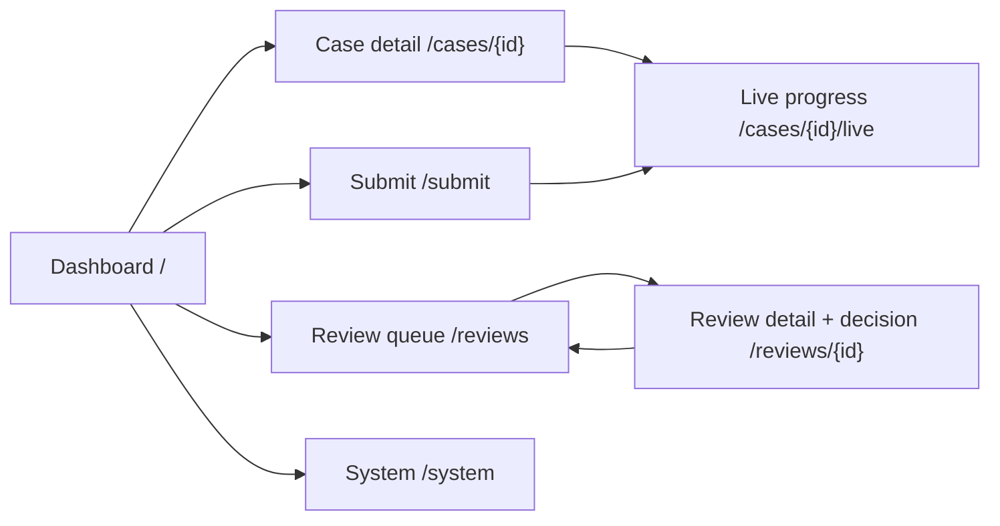

# Galatiq Invoice Processing - UI Plan

Prepared: 2026-08-06

Status: implemented 2026-08-06 (`src/invoice_agents/ui/`, `invoice-agents ui`, tests under
`tests/ui/`). This plan adds a local web UI on top of the existing, verified CLI prototype.
Nothing in it changes agent behavior, policy, storage, or failure semantics.

> **Historical design:** The later application-audit repair adds immutable source snapshots,
> bounded uploads/PDF workers, CSRF/origin/host/header enforcement, durable submission and batch
> claims, one application-wide model semaphore, responsive real-anchor keyboard behavior, and
> cursor-correct SSE replay. The current Markdown system guide and reference are authoritative
> where this original UI plan conflicts.

## 1. Goal and audience

Give the two people who actually touch this system a screen that is faster and clearer than the CLI:

| Persona | What they need |
|---|---|
| Operator (runs invoices) | Submit files, watch progress, see per-case outcomes at a glance, find out *why* something failed or stopped |
| Reviewer (VP / approver) | A queue of pending reviews, the full evidence package in readable form, a decision form with a required reason, and one-click resume |

Design intent in one sentence: **a calm, evidence-first review console** - not a flashy dashboard.
The system's core value is failure transparency; the UI's job is to make that transparency legible.

## 2. Non-negotiable UI principles

These extend the engineering principles in `IMPLEMENTATION_PLAN.md` to the presentation layer:

1. **The UI renders stored state only.** It never computes, softens, or summarizes a status. The four
   case statuses (`SUCCEEDED`, `NEEDS_HUMAN`, `FAILED`, `INCOMPLETE`) and four decisions (`APPROVE`,
   `REJECT`, `HOLD`, `FAILED`) map 1:1 to visual treatments. No roll-up ever displays a green check
   unless the stored status is `SUCCEEDED`.
2. **Rejection is not an error.** `SUCCEEDED` + `REJECT` renders as a completed, healthy workflow
   with a neutral "rejected" badge - never red.
3. **Raw before normalized.** Every displayed field that came from an invoice shows the raw source
   value, with the normalized value and the recorded normalization note alongside. Ambiguity notes
   are always visible, never behind a tooltip-only affordance.
4. **Human decisions require humans.** The decision form enforces exactly what
   `record_human_decision` enforces (reviewer + reason required, mappings for `ESTABLISH_MAPPING`,
   superseded case for `SUPERSEDE_REVISION`). No default-selected decision, no one-click approve.
5. **No new mutation paths.** The UI calls the same service functions the CLI calls
   (`process_invoice`, `process_batch`, `resume_case`, `record_human_decision`, `WorkflowStore`
   loaders). It never writes SQL of its own.
6. **Secrets stay invisible.** The UI shows *whether* `XAI_API_KEY` is configured, never any part of
   its value. Same for anything the redaction layer would strip from events.

## 3. Technology choice

**FastAPI + Jinja2 templates + htmx + Server-Sent Events, styled with hand-rolled CSS design
tokens. No Node toolchain, no SPA framework, no CDN dependencies.**

Rationale:

- The repository is a pure-Python `uv` project; a Vite/React chain would double the toolchain for
  one local screen. Jinja + htmx delivers every interaction this UI needs (list refresh, form post,
  live progress) with server-rendered HTML.
- FastAPI is already ecosystem-adjacent (Pydantic v2 everywhere); the existing models serialize
  straight into templates with `model_dump()`.
- SSE (via `sse-starlette`) is the simplest live channel for streaming new `events` rows while a
  case runs; no websocket state to manage.
- All assets ship in-repo (one CSS file, one small htmx vendored file), so the UI works fully
  offline - consistent with "xAI is the only remote dependency."

New dependencies (runtime extra `ui`): `fastapi`, `uvicorn`, `jinja2`, `sse-starlette`,
`python-multipart` (file upload). Vendored static: `htmx.min.js`.

Launch command:

```text
uv run invoice-agents ui --host 127.0.0.1 --port 8787
```

Binds to localhost only by default. There is no auth layer because there is no remote exposure;
adding auth is a prerequisite before ever changing the bind address, and the CLI refuses non-loopback
hosts without an explicit `--allow-remote-i-understand` flag.

## 4. Information architecture



Five pages. Nothing is more than two clicks from the dashboard.

### 4.1 Dashboard (`/`)

- **Preflight strip** (top): three compact indicators - inventory DB verified, workflow DB
  verified, API key present. Each is either "OK" or the exact stop reason
  (`DATABASE_MISSING`, `PROVIDER_PREFLIGHT_FAILED`, ...). Red strip = the run buttons are disabled,
  with the fix command shown verbatim (`uv run python -m invoice_agents.db migrate ...`).
- **Summary tiles**: counts by case status for the selected time window. Four tiles, one per
  status, using the status color system. A fifth tile shows pending reviews and links to `/reviews`.
- **Case table**: one row per case - invoice number, vendor, source format chip, declared amount +
  currency, status badge, decision badge, payment badge, started/finished, duration. Filter by
  status/decision/format; text search over invoice number and vendor. Row click opens case detail.
- **Run actions**: "Process invoice" (file picker over `data/invoices/` plus upload) and
  "Run batch" with a concurrency selector capped at the configured limit.

### 4.2 Case detail (`/cases/{case_id}`)

The page is a vertical narrative matching the pipeline order, so a reader can replay the case:

1. **Header**: invoice number, vendor, amount, status/decision/payment badges, stop reason
   (verbatim), case + source IDs in monospace with copy buttons, link to the raw
   `artifacts/results/{case_id}.json`.
2. **Source & extraction**: file name, format, SHA-256 (truncated, copyable), size, page/row count.
   Field table with columns *Field / Raw / Normalized / Normalization / Ambiguity* - raw always
   first (principle 3). Missing fields and conflicts render as amber list items.
3. **Line items**: raw item, quantity, unit price, declared vs calculated line total; any nonzero
   delta highlighted with the exact difference. Evidence locator (`line:12`, `$.line_items[3]`,
   `row:7`, xpath, page) shown per line.
4. **Identity**: candidate table - relationship (`EXACT_ARTIFACT`, `DUPLICATE_REPRESENTATION`,
   `POSSIBLE_REVISION`, `CONFLICT`), prior case link, hash match, explanation.
5. **Inventory comparison**: per-SKU aggregate requested vs available stock, status chip
   (`AVAILABLE` / `EXCEEDS_STOCK` / `OUT_OF_STOCK` / `UNKNOWN` / `AMBIGUOUS` /
   `INVALID_QUANTITY`), the exact queried row, and unresolved fuzzy candidates clearly labeled
   "suggestion only - not a mapping."
6. **Financial recomputation**: declared vs calculated subtotal / tax / fees / total with deltas;
   the `tax_basis` sentence displayed as-is; the `unavailable_reconciliations` list rendered in
   full so nobody assumes vendor/PO/price checks happened.
7. **Critique**: supported findings, challenged findings, missing evidence, follow-up requests,
   critic's recommended disposition.
8. **Review & human decision** (when present): reasons, questions, agent recommendation and
   rationale, then the human outcome - reviewer, decision, reason, timestamp, mappings created,
   superseded case.
9. **Payment** (when present): ledger row - status, payment ID, idempotency key (truncated),
   amount, `duplicate_of` link when the attempt returned the prior transaction.
10. **Event timeline** (collapsed by default): every `events` row in order - event type, agent,
    timestamp, correlation IDs - with a JSON payload disclosure per event. This is the audit trail,
    rendered, not reinterpreted.
11. **Errors**: for `FAILED`/`INCOMPLETE`, the error records (category, message, stop reason,
    provider request ID) at the top of the page, not buried.

### 4.3 Review queue (`/reviews`) and review detail (`/reviews/{review_id}`)

Queue: pending by default, toggle for all; columns review ID, case, amount, agent recommendation,
reason count, age. Age over a configurable number of hours gets an amber accent - queued reviews
should not silently rot.

Detail = the complete package `create_review_request` persists, in reading order:

- The **exact questions** the workflow asked the human, as the page's lead element.
- Every review reason, verbatim.
- The same evidence sections as case detail (embedded, not linked away).
- Agent recommendation + rationale and the critic block, clearly attributed.
- **Decision form**: reviewer (prefilled from last use, still editable), decision radio group with
  all five `HumanDecisionKind` values and a one-line consequence sentence under each (e.g.
  `REQUEST_CORRECTION` -> "case will HOLD; no payment"), required free-text reason,
  conditional sub-forms:
  - `ESTABLISH_MAPPING`: rows of *raw item -> SKU* where raw items come from the case's unresolved
    items and SKUs from a `SELECT`-backed dropdown of real inventory rows;
  - `SUPERSEDE_REVISION`: a dropdown of that invoice number's prior cases showing each case's
    amount and paid state.
- Submit records the decision, then offers **Resume case now**, which starts the resume in the
  background and returns to the review queue; the case's live view remains linked for watching
  progress. Already-resolved reviews render read-only with the recorded outcome.

### 4.4 Live progress (`/cases/{case_id}/live`)

Used by submit, batch, and resume. An SSE stream tails new `events` rows for the case and renders
a growing timeline: agent handoffs as arrows between named agent chips, tool calls with name and
duration, provider retries, then the terminal banner in the status color with stop reason. If the
stream drops, the page falls back to the persisted case detail - the DB is the source of truth,
the stream is only a window onto it.

Batch gets a matrix view: one row per submitted file with a live status chip; finished rows link
to their case pages. Per-case failures stay visible in place (no aggregate "batch failed").

### 4.5 System (`/system`)

Read-only: DB verification output (path, schema version, integrity, tables), configured policy
(threshold amount/currency/effective date), circuit-breaker settings, model + base URL constants,
key-present boolean, and a "Run local test command" copy block. This page is where the demo starts.

## 5. Visual design

### 5.1 Design tokens

One CSS file, custom properties, automatic dark mode via `prefers-color-scheme`.

```text
Typeface   UI: system stack (Segoe UI / SF Pro / Inter fallback)
           Data: ui-monospace (IDs, hashes, amounts, locators, JSON)
Type scale 13 / 14 / 16 / 20 / 28 px; 1.5 line height for prose, 1.35 for tables
Spacing    4px base grid; card padding 16; section gap 24; page gutter 32
Radius     6px controls, 10px cards
Elevation  borders over shadows (1px solid var(--border)); one shadow level for modals only
```

Palette (light / dark):

| Token | Role | Light | Dark |
|---|---|---|---|
| `--bg` | page | `#FAFAF8` | `#111312` |
| `--surface` | cards, tables | `#FFFFFF` | `#1A1D1B` |
| `--border` | hairlines | `#E4E4DE` | `#2A2E2B` |
| `--text` | primary text | `#1F2421` | `#E8EAE6` |
| `--text-dim` | secondary | `#6B7370` | `#9AA29D` |
| `--accent` | links, focus, primary buttons | `#245D4C` | `#5FB79A` |
| `--ok` | SUCCEEDED, PAID | `#1F7A45` | `#4CC47E` |
| `--warn` | NEEDS_HUMAN, HOLD, ambiguity | `#9A6B00` | `#E0B34D` |
| `--fail` | FAILED, payment FAILED | `#B3372E` | `#E06C5F` |
| `--pause` | INCOMPLETE, DUPLICATE, neutral badges | `#5A5F7A` | `#9BA2C4` |

Status is never conveyed by color alone: every badge carries its literal status word, and deltas
carry an explicit sign and amount. Focus states use a 2px `--accent` outline; all interactive
targets are >= 32px tall; tables keep `<th scope>` and captions for screen readers. Target WCAG AA
contrast in both themes.

### 5.2 Component inventory

Small and boring on purpose - roughly twelve components, all server-rendered partials:

status badge - decision badge - payment badge - format chip - agent chip - preflight strip -
summary tile - data table (sortable header, sticky first column) - field-provenance row (raw /
normalized / note) - delta cell (highlight iff nonzero) - JSON disclosure - decision form.

Empty states get one sentence and the relevant command (e.g. empty dashboard shows the
`process`/`batch` commands); they are part of the design, not an afterthought.

### 5.3 Layout sketches

Dashboard:

```text
+----------------------------------------------------------------------+
| Preflight: inventory OK - workflow OK - key OK        [System]       |
+----------------------------------------------------------------------+
|  [12 SUCCEEDED] [3 NEEDS_HUMAN] [1 FAILED] [2 INCOMPLETE] [3 review] |
+----------------------------------------------------------------------+
| Filter: [status v] [decision v] [format v] [search......]  [Process] |
|                                                            [Batch]   |
| Invoice   Vendor            Amount      Status       Decision  Pay   |
| INV-1001  Widgets Inc.      5,000 USD   SUCCEEDED    APPROVE   PAID  |
| INV-1002  Global Supplies   15,000 USD  NEEDS_HUMAN  -         -     |
| INV-1009  (missing)         -250 USD    NEEDS_HUMAN  -         -     |
+----------------------------------------------------------------------+
```

Review detail (decision rail pinned right on wide screens, stacked on narrow):

```text
+---------------------------------------------+------------------------+
| Questions for the reviewer                  | Decision               |
| 1. Do evidence and deltas support payment?  | Reviewer [vp@ex.com]   |
| 2. Resolve inventory/date ambiguities...    | ( ) APPROVE            |
|                                             | (x) REJECT             |
| Review reasons (4)  - verbatim list         | ( ) REQUEST_CORRECTION |
| Evidence: extraction - lines - inventory -  | ( ) ESTABLISH_MAPPING  |
|           financial - identity - critique   | ( ) SUPERSEDE_REVISION |
| Agent recommendation: HOLD (rationale...)   | Reason [___________]   |
|                                             | [Record decision]      |
+---------------------------------------------+------------------------+
```

## 6. Backend surface

New module `src/invoice_agents/ui/` (`server.py`, `routes.py`, `sse.py`, `templates/`,
`static/`). Read endpoints delegate to `WorkflowStore` and small new read-only queries (case list
with filters, event tail after an event ID); mutations delegate to existing services:

```text
GET  /                          dashboard (htmx partial: filtered case table)
GET  /cases/{id}                case detail
GET  /cases/{id}/events         SSE stream (tail events table)
GET  /reviews                   queue
GET  /reviews/{id}              package + form
POST /reviews/{id}/decision     -> record_human_decision
POST /cases/{id}/resume         -> resume_case (background task) -> redirect to review queue
POST /submit                    -> process_invoice (background task)
POST /batch                     -> process_batch (background task)
GET  /system                    verify_database output + settings snapshot
```

Run/resume execute in a background asyncio task registry keyed by case ID, reusing the existing
bounded-concurrency semaphore settings; a second submit for a case already running returns the
running view instead of double-starting. SQLite access stays short-lived-connection per request
(the store already works that way); the events SSE poller reads with a `> last_event_id` cursor at
~1s cadence, which is well within local SQLite comfort.

Uploads are streamed through a hard byte ceiling into immutable content-addressed storage. The
persisted `SourceArtifact` names that snapshot; later reads verify its size and hash and never fall
back to a mutable upload or sample path.

## 7. Delivery phases

Each phase is shippable and independently valuable; stop after any of them and the repo is still
coherent.

### Phase U0 - Read-only console

Dashboard, case detail, review queue/detail (read-only), system page. No mutations at all.
*Exit criterion*: with the existing `workflow_e2e2.db` copied to `workflow.db`, all persisted
cases - including the HITL reject case and both `INCOMPLETE` cases - render correctly, and a
`FAILED` fixture case shows its error records at the top.

### Phase U1 - Decisions and resume

Decision form wired to `record_human_decision`, resume button wired to `resume_case`, live SSE
view for the resumed run.
*Exit criterion*: the INV-1002 scenario from `DEMO.md` (pause -> reject with reason -> resume ->
`SUCCEEDED`/`REJECT`, no payment row) is completed entirely in the browser, and the recorded
decision matches what `review show` prints in the CLI.

### Phase U2 - Submit and batch

File picker/upload, single-run and batch execution with the live matrix.
*Exit criterion*: processing `invoice_1001.txt` from the browser produces the same `CaseResult`
JSON as the CLI path, and a batch over the full corpus shows per-case terminal states with no
aggregate masking.

### Phase U3 - Polish

Dark mode audit, keyboard navigation (`/` focus search, `j/k` row movement, `Enter` open), copy
buttons, empty states, print stylesheet for the review package (reviewers forward PDFs), and a
small usage strip on case detail (tokens, model calls, latency from `UsageSummary`).

*Testing across phases*: template rendering tests against fixture `CaseResult`/`ReviewRequest`
objects (golden HTML fragments for badges and provenance rows), route tests with an ephemeral
migrated workflow DB, one Playwright smoke per phase exit criterion (kept out of the default
`pytest -m "not live"` selection, like the live suite). The decision form is tested for the same
rejection cases as `record_human_decision` (missing reason, missing mapping, resolved review).

## 8. Explicit non-goals

- No authentication/multi-user/roles - the prerequisite for any non-loopback deployment, tracked
  but not built.
- No editing of extracted evidence in the browser; corrections flow through
  `REQUEST_CORRECTION`, corrected source files, and reprocessing.
- No charts/analytics beyond the status tiles; this is a workbench, not BI.
- No real payment surface. The payment section always carries the word "mock" in the UI.
- No replacement of the CLI; every UI action names its CLI equivalent in a footer hint, keeping
  the documented terminal path first-class.
